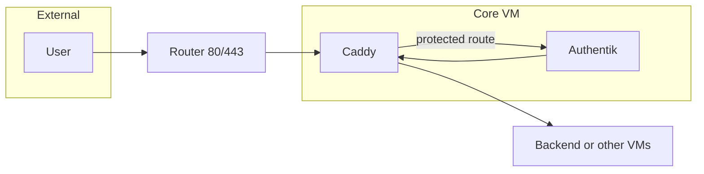
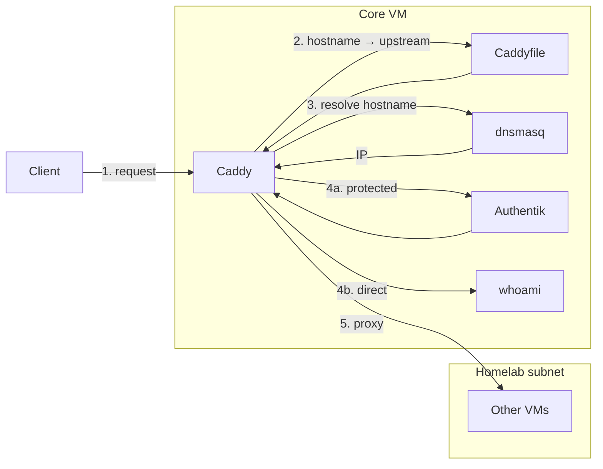

# Chapter 2A — Core VM (Purpose + App Selection)

## Introduction

**Prerequisites:** [Chapter 1](Chapter1-proxmox.md) (template created), [Chapter 2](Chapter2-vms.md) (VMID scheme).

The Core VM is the homelab’s “front door” and access foundation. It exists to make everything else reachable, consistently named, and safely gated.

When this VM is healthy, the rest of the system feels coherent. When it isn’t, the lab may still be running — but access becomes unreliable, inconsistent, or unsafe.

> ### 🧠 Reasoning Note: One Front Door, One Boundary
> The internet should see exactly one thing: the Core VM.
> Everything else stays private and is reachable only through controlled routing.
>
> This VM is intentionally designed to feel appliance-like: stable, predictable, and rarely changed.

> ### 🧠 Design Note: The Only Unauthenticated Surface
> I want exactly one service reachable without login: a simple personal homepage (links to GitHub/LinkedIn and optionally links to apps that still require authentication).
> Everything operational stays behind SSO.
> The details of what lives on that homepage belong in the `apps` VM.

---

## Table of contents
- [Provisioning the Core VM](#provisioning-the-core-vm-from-the-template)
- [What the Core VM is responsible for](#what-the-core-vm-is-responsible-for)
  - [Request flow (at a glance)](#request-flow-at-a-glance)
  - [How the core stack works together](#how-the-core-stack-works-together)
- [Why these services belong together](#why-these-services-belong-together)
- [Design constraints](#design-constraints)
- [App selection](#app-selection)
  - [Reverse proxy: Caddy](#reverse-proxy-caddy)
  - [Identity / SSO: Authentik](#identity--sso-authentik)
  - [Internal naming: dnsmasq](#internal-naming-dnsmasq-for-the-homelab-subnet)
  - [Dynamic DNS: ddclient](#dynamic-dns-ddclient)
  - [Troubleshooting endpoint: whoami](#troubleshooting-endpoint-whoami--echo-service)
- [What breaks if the Core VM disappears](#what-breaks-if-the-core-vm-disappears)
- [FAQ](#faq)

---

## Provisioning the Core VM (From the Template)

The Core VM is the only VM that the internet touches. It deserves an intentional baseline.

**Full procedure:** The generic clone steps (template 9000, Cloud-Init, verify, snapshot) live in [Chapter 2 → Spinning Up the VMs](Chapter2-vms.md#the-practical-step-spinning-up-the-vms-from-the-template). Below are the values for **core** only. For configuring and deploying the core Docker stack (`.env`, compose, bootstrap, deploy), see [Chapter 3A — Core stack](Chapter3a-core-stack.md).

**VMID + name**
- `110` → `core`

**Starting resources**
- **vCPU:** 2
- **RAM:** 4GB

### Steps (Proxmox)

1. Clone template `9000` → new VM `110 core`
2. Set CPU/RAM to 2 cores / 4GB
3. Confirm SSH key in Cloud-Init
4. Boot and verify:
  ```bash
   docker --version && systemctl status qemu-guest-agent --no-pager && free -h
  ```
5. Snapshot: core - fresh provisioned 

## What the Core VM is responsible for

The Core VM concentrates four primitives that everything else depends on. The diagrams below ([request flow](#request-flow-at-a-glance) and [how the stack works together](#how-the-core-stack-works-together)) summarize how they interact.

- **Ingress + HTTPS**  
  Terminate TLS and route requests to internal services across VMs.

- **Identity / SSO**  
  Central authentication so downstream apps don’t become their own security islands.

- **Internal naming (DNS)**  
  Stable hostnames for VMs/services so the system doesn’t depend on static IPs.

- **Public DNS (DDNS)**  
  When your ISP assigns a dynamic public IP, something must tell your domain provider (e.g. Namecheap, Cloudflare) what that IP is so that your domain keeps resolving to the Core VM. DDNS is that "something"; without it, the front door can become unreachable after an IP change.

### Request flow (at a glance)

All public traffic hits the Core VM. The reverse proxy terminates TLS, optionally checks identity, then routes to the right backend (a container on core or a service on another VM).


```mermaid
flowchart LR
    subgraph External
        User[User]
    end
    Router[Router 80/443]
    subgraph Core["Core VM"]
        Caddy[Caddy]
        Auth[Authentik]
    end
    Backend[Backend or other VMs]

    User --> Router
    Router --> Caddy
    Caddy -->|"protected route"| Auth
    Auth --> Caddy
    Caddy --> Backend
```

### How the core stack works together


```mermaid
flowchart LR
    Client[Client] -->|"1. request"| Caddy
    Caddy -->|"2. hostname → upstream"| Config[Caddyfile]
    Config --> Caddy
    Caddy -->|"3. resolve hostname"| dnsmasq
    dnsmasq -->|"IP"| Caddy
    Caddy -->|"4a. protected"| Authentik
    Authentik --> Caddy
    Caddy -->|"4b. direct"| whoami
    Caddy -->|"5. proxy"| Backends

    subgraph Core["Core VM"]
        Caddy[Caddy]
        Config
        Authentik[Authentik]
        dnsmasq[dnsmasq]
        whoami[whoami]
    end

    subgraph Homelab["Homelab subnet"]
        Backends[Other VMs]
    end
```

**What each step does:**

1. **Request** — Caddy receives the request. The client used a hostname (e.g. `tv.server-name.net`); public DNS already resolved it to your public IP, and the router forwarded 80/443 to the Core VM. Caddy sees the request with that hostname. (Keeping that public DNS record correct when your IP changes is the job of [DDNS](#dynamic-dns-ddclient), which runs separately on core.)  
   *Example:* `tv.server-name.net`

2. **Hostname → upstream** — Caddy looks up the request hostname in its **config** (the Caddyfile). The config is static: it maps each public hostname to an **upstream** (where to send the traffic). The upstream is either a hostname:port (e.g. `media.lan:32400`) or an IP:port. This step is pure config lookup; no DNS is involved yet. Caddy also knows from config whether this route is protected (SSO) or direct.  
   *Example:* `tv.server-name.net` → `sonarr.homelab.arpa:8989`

3. **Resolve hostname** — If the upstream is a **hostname** (not an IP), Caddy must resolve it to an IP before it can connect. The Core VM uses **dnsmasq** as its DNS resolver. So Caddy asks the system resolver (dnsmasq) “what is `media.lan`?” and dnsmasq returns the VM’s IP. **dnsmasq only answers DNS queries;** it does not route or proxy. Its records are maintained on core (you or your automation configure them). Other VMs’ services do not query dnsmasq; they don’t need to know it exists.  
   *Example:* `sonarr.homelab.arpa` → `192.168.1.80`

4. **Protected or direct** — **Authentik** is only involved for protected routes. If the config says this hostname is behind SSO, Caddy sends the request to Authentik first (forward auth); Authentik checks the user and returns success or redirect to login; only then does Caddy proxy to the backend. For direct routes (e.g. whoami, a public page), Caddy skips Authentik and proxies straight away.  
   *Example (if SSO):* request forwarded to Authentik on core (e.g. `192.168.1.50`); after auth OK, Caddy continues. *Example (direct):* skip to step 5.

5. **Proxy** — Caddy forwards the request to the upstream: either the resolved IP:port (another VM) or a local container (e.g. whoami). The actual connection is made by Caddy; dnsmasq only supplied the IP.  
   *Example:* Caddy sends the request to `192.168.1.80:8989` (the actual service).

---

## Why these services belong together

This VM has a deliberately large blast radius because it owns shared infrastructure:

- If **ingress** is down, most services are unreachable from the outside.
- If **identity** is down, access control becomes inconsistent or collapses into per-app logins.
- If **DNS** is down, service discovery and callback flows fail in confusing ways.
- If **DDNS** is down or unused, your public IP may eventually change and your domain will stop pointing at the lab until you update it (manually or by fixing DDNS).

Keeping these together makes the system easier to reason about: there is one place to debug “access is broken,” and one place where security posture is defined.


> ### 🧠 Tradeoff: Bigger Blast Radius, Fewer Failure Modes
> Concentrating the access plane means `core` matters more — on purpose.
> It keeps the lab’s security posture and reachability understandable and recoverable.

---

## Design constraints

- **Only VM exposed publicly:** ports 80/443 terminate here, nowhere else.
- **Port forwarding is narrow by design:** only ports 80/443 are forwarded to `core`. The reverse proxy terminates TLS, upgrades HTTP → HTTPS, and forwards internally based on the requested hostname.
- **Stable by intent:** changes are infrequent and deliberate.
- **Recoverable:** restore should be straightforward (backup/snapshot + minimal state).
- **Security-first defaults:** consistent HTTPS and sane headers everywhere.
- **No “nice-to-have” apps:** dashboards/homepages live in `apps`, not here.

> ### 🧠 Escape Hatch: Admin Access Should Not Depend on Core
> If `core` is down, I still need a way to fix things.
> Admin access is handled out-of-band (e.g., Tailscale to the host).

---

## App selection

| App | Role | Key choice |
|-----|------|------------|
| Caddy | Reverse proxy | HTTPS + routing; first-class Let's Encrypt |
| Authentik | Identity / SSO | One login across many apps |
| dnsmasq | Internal naming | Local records + upstream forwarding; low churn |
| ddclient | Dynamic DNS (optional) | Keeps public DNS pointed at your IP; supports Namecheap, Cloudflare, others |
| whoami | Troubleshooting | Echo endpoint for access-plane validation |

---

### Reverse proxy: Caddy

**Why this belongs in `core`**  
The reverse proxy is the lab’s front door: it owns HTTPS termination and routing. Centralizing it avoids per-VM exposure and keeps access policy consistent.

**Alternatives considered**
- **Traefik:** powerful middleware ecosystem and great Docker integration, but its main advantage (label-driven auto-discovery) doesn’t apply cleanly when each VM is its own Docker island.
- **Vanilla Nginx:** extremely stable and explicit, but typically requires a separate certificate automation flow (more moving parts in a VM that should stay boring).

**Why Caddy won**
- **Fits multi-VM routing naturally:** explicit upstreams without needing Docker socket access across VMs.
- **First-class Let’s Encrypt:** public certs are automated without adding a separate certificate-management stack.
- **Simple mental model:** file-driven routing is easy to explain, back up, and restore.

**Tradeoffs accepted**
- Adding a new externally reachable service usually means touching proxy config in `core`. That friction is acceptable here because it reinforces deliberate change.

> **TODO (cert strategy):** current setup uses HTTP challenge. DNS challenge (e.g., wildcard certs) may become the preferred path later because it makes adding new subdomains/services easier and less brittle.

---

### Dynamic DNS: ddclient

**Why this belongs in `core`**  
The reverse proxy and TLS stack only work if clients can reach the Core VM. That requires your public domain to resolve to your current public IP. Most home connections get a dynamic IP from the ISP; when it changes, your domain would otherwise point to the old address. A DDNS client on core periodically tells your domain provider (Namecheap, Cloudflare, etc.) what your current IP is, so the "front door" stays reachable without manual updates.

**What ddclient does**  
ddclient is a small, mature client that detects your public IP (via web check or router) and updates one or more Dynamic DNS providers using their API or HTTP protocol. You configure it once per domain/provider; it then runs on a schedule (e.g. every few minutes) and only sends an update when the IP has changed. It does not participate in request handling—Caddy, Authentik, and dnsmasq are unchanged. It is purely about keeping the A (and optionally AAAA) record for your domain correct at your registrar or DNS host.

**Alternatives considered**
- **Router built-in DDNS:** many routers support Namecheap or generic DDNS; if that works for you, no container is needed. Running ddclient on core keeps DNS updates under the same VM as the rest of the access plane and avoids depending on router firmware.
- **Cron + curl script:** a one-liner calling the provider’s HTTP API is possible, but ddclient supports many providers (Namecheap, Cloudflare, No-IP, Duck DNS, etc.) with a single config file and handles retries, caching, and IPv6 where needed.

**Why ddclient won**
- **Configurable for many providers:** one image and one config format for Namecheap, Cloudflare, and others; easy to switch or add domains later.
- **Optional and low impact:** the core stack runs without it; you enable it only when you use dynamic DNS. In this repo it is an optional [overlay](Chapter3a-core-stack.md): set **ENABLE_DDNS=1** in `.env`; bootstrap and the **core** alias then include `compose.ddclient.yml` so ddclient is part of the stack when you run `up`, `logs`, etc.
- **Operationally boring:** set `ddclient.conf` once, then it runs in the background; no ongoing maintenance.

**Configuration**  
ddclient is configured via a single file, `ddclient.conf`, in the core stack config directory (`CONFIG_ROOT/ddclient/`). You choose a protocol (e.g. `namecheap`, `cloudflare`) and supply the credentials and hostnames to update. See the [ddclient documentation](https://ddclient.net/) and your provider’s DDNS instructions (e.g. Namecheap “Dynamic DNS” in the domain dashboard). When **ENABLE_DDNS=1**, bootstrap creates the ddclient config directory and a commented starter `ddclient.conf`; you edit the file to add your domain and credentials. No secrets in `.env` are required for ddclient—all provider-specific settings live in `ddclient.conf`.

**When using DDNS you must configure ddclient** (provider, domain, credentials in `ddclient.conf`) for it to do anything useful. Choose one of these workflows:

- **Bootstrap → configure → bring up:** Set **ENABLE_DDNS=1** in `.env`, run bootstrap (creates the ddclient dir and starter config), edit `CONFIG_ROOT/ddclient/ddclient.conf` with your provider and credentials, then run deploy or `docker compose up -d`. Deploy also sets up the **core** alias so you can use `core up -d`, `core logs -f`, etc.
- **Bring up → configure → restart:** Run deploy (or `docker compose up -d`) first; then edit `ddclient.conf`, and restart ddclient so it picks up the config—e.g. `core restart ddclient` (if you use the alias) or `./restart-ddclient.sh` from the stack directory. See [Chapter 3A — ddclient how-to](Chapter3a-core-stack.md#ddclient) for the full procedure.

A small **helper script** `restart-ddclient.sh` in the core stack directory restarts the ddclient container after you change `ddclient.conf`, so you don't have to remember the compose overlay flags. Use it whenever you edit the DDNS config.

> ### 🧠 Design Note: DDNS Is Optional
> If you have a static public IP or use router-based DDNS, you can leave ddclient disabled. The rest of the access plane does not depend on it.

---

### Identity / SSO: Authentik

**Why this belongs in `core`**  
Identity is a shared primitive. Without central SSO, access control fragments and every app becomes its own credential and permission model.

**Alternatives considered**
- **Authelia:** simpler and lighter, excellent for “protect behind proxy + MFA,” but it’s less of a full identity platform if the lab grows into richer SSO flows.
- **Per-app accounts:** workable at small scale, but quickly becomes inconsistent and difficult to manage safely.

**Why Authentik won**
- **Strong fit for “login once, access many”:** an identity layer that supports consistent enforcement across many apps.
- **UI-driven administration is fine:** user and policy changes are rare events in a small lab.
- **Supports clean audience separation:** a single domain with subdomains can express different audiences (guest homepage vs authenticated apps vs admin-only endpoints).

**Initial stance on MFA**
MFA isn’t required on day one. The first win is central identity and consistent enforcement; hardening can tighten later without rewriting the access model.

> **Open question:** start with “gate in front” (proxy-level auth) for consistency and simplicity, then revisit per-app OIDC where it provides better UX or permissions. This tradeoff is worth deciding deliberately because it shapes how identity is enforced across the lab.

---

### Internal naming: dnsmasq for the homelab subnet

**Why this belongs in `core`**  
Most VMs use DHCP. DNS provides stable names without committing to static IP management, and it makes routing more durable.

**Alternatives considered**
- **“Just use Avahi/mDNS”:** convenient as a fallback, but multicast discovery is harder to reason about and less reliable as the lab grows.
- **Pi-hole / AdGuard:** useful, but heavier than necessary for a DNS role that should stay boring.

**Why dnsmasq won**
- **Small scope:** local records for the homelab subnet, forwarding everything else upstream.
- **Operationally boring:** mature, lightweight, and easy to restore from a tiny config.
- **Low churn:** DNS should be predictable and rarely touched.

> ### 🧠 Design Intent: DNS Should Stay Boring
> The goal is stable naming, not turning DNS into an ongoing project.

> ### 🧠 Practical Note: DNS + DHCP Is a Tradeoff
> Static IPs (or DHCP reservations) are still the most durable foundation for internal DNS.
> For now, the lab relies on DHCP typically reassigning the same IPs to VMs, but this is not a perfect guarantee.
>
> A more stable future improvement is having DNS/DHCP integrate so records update automatically when leases change (router/DHCP integration or a dynamic approach).

---

### Troubleshooting endpoint: whoami / echo service

**Why this belongs in `core`**  
A tiny echo endpoint is a practical way to validate the front door:
- external reachability,
- TLS behavior,
- routing correctness,
- security headers.

It’s also a clean monitoring target for “the access plane is up” without depending on any workload VM.

**Implementation choice**
- Docker image: `traefik/whoami` (deployed as a minimal standalone container behind Caddy).

**Alternatives considered**
- **Custom tiny web app:** flexible, but unnecessary maintenance burden for a role that should stay boring.
- “Just test with an app endpoint” — but that couples availability checks to whatever app happens to be up.

**Why `traefik/whoami` won**
- Small, deterministic, and purpose-built for debugging and health checks.
- Zero-config startup with predictable output (method, path, headers, remote address), which makes proxy/TLS debugging fast.
- Widely used in reverse-proxy workflows, so examples and troubleshooting references are easy to find.

**Security note** — whoami is usually left on a **direct** route (no SSO) so health checks and quick “is the front door up?” tests work without logging in. That means anyone who can reach the hostname gets an echo of the request (method, path, headers, remote address). Risk is **low**: no auth bypass, no code execution, and it’s still behind TLS and the single front door. **XSS and injection:** whoami echoes request headers (and other input) into the response body. If that response were served as `text/html` and the echoed content were not escaped, an attacker could send a header like `X-Foo: <script>...</script>` and cause reflected content to run in a victim's browser (XSS). The core stack **hardens** whoami without relying on obscurity: Caddy always forces **`Content-Type: text/plain`** on the response (overwriting any upstream value) so the browser never interprets the body as HTML.

**Access:** By default whoami is **reachable from anywhere** so external uptime checkers (e.g. UptimeRobot, Better Uptime) can verify that the front door and core are up. **Optional IP allowlist:** set **`WHOAMI_ALLOW_CIDRS`** in `.env` (space-separated CIDRs) to restrict whoami to those IPs only (everyone else gets 403). A suggested value is private ranges plus Tailscale: `127.0.0.0/8 10.0.0.0/8 172.16.0.0/12 192.168.0.0/16 100.64.0.0/10`. See [Chapter 3A](Chapter3a-core-stack.md) for the env table and Caddyfile generation.

**Rate limiting:** Stock Caddy has no built-in rate limit. To harden whoami further (e.g. limit requests per IP so it stays useful for uptime checks but is harder to abuse), use one of: host-level limits (e.g. `nftables`/`iptables` connlimit, or **fail2ban** on Caddy access logs), or build Caddy with the `rate_limit` plugin (xcaddy) and add a rate_limit block in the Caddyfile. The repo does not ship a custom Caddy image; if you add one, you can wire `WHOAMI_RATE_LIMIT` (or similar) into your Caddyfile generation.

---

## What breaks if the Core VM disappears

**Immediately affected**
- Public access to anything behind the reverse proxy
- TLS termination and certificate automation
- SSO flows and centralized access enforcement
- Internal hostname resolution (for homelab hostnames)
- DDNS updates (if you used ddclient on core—your domain will keep pointing at the last IP until core is back or you update it elsewhere)

**Should remain intact**
- Workload data stored on other VMs/NAS
- VM operation via Proxmox
- Direct admin access paths that don’t depend on `core`

---

## FAQ

**Q: Why is `core` the only VM exposed to the internet?**  
*A:* It concentrates the attack surface into one hardened entry point and avoids accidental exposure of internal services. Everything else stays private and reachable only through controlled routing.*

**Q: Why not run a reverse proxy on each VM?**  
*A:* Multiple entry points multiply security mistakes and create drift. A single front door keeps access policy consistent and debugging simpler.*

**Q: Why Caddy instead of Traefik?**  
*A:* Traefik shines when it can auto-discover containers via labels. With each VM being its own Docker island, that advantage doesn’t apply cleanly. Caddy keeps routing centralized and explicit while still providing automated public certificates.*

**Q: Why not host the homepage in `core` if it’s the “front door”?**  
*A:* The access plane and the user experience are different concerns. Anything expected to evolve lives outside `core` so the VM that everything depends on stays stable.*

**Q: What’s the biggest risk to manage in `core`?**  
*A:* Accidental exposure. A mistake here can affect the entire lab, which is why this VM has strict scope and conservative change discipline.*

**Q: What happens if `core` breaks — how do I still access the lab?**  
*A:* I treat `core` as the “front door,” not the only way in. If the reverse proxy / DNS / SSO stack goes down, public access will be impacted — but I can still recover through out-of-band paths:*
- *Proxmox UI/console access to reach VMs directly (even if DNS/routing is broken).*
- *SSH by IP from the local LAN as a baseline fallback.*
- *Avahi/mDNS hostnames as a convenience fallback for local access when DNS is down.*
- *Tailscale to the host for admin access that does not depend on `core` being healthy.*


