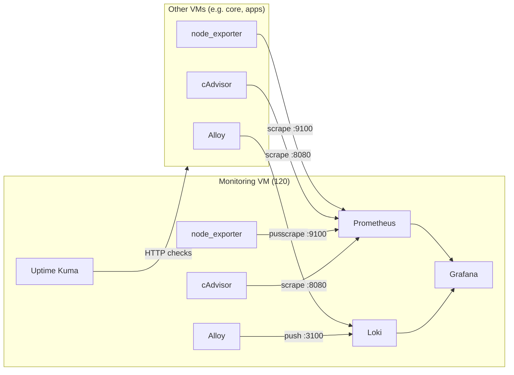

# Chapter 2B — Monitoring VM (Purpose + App Selection)

## Introduction

**Prerequisites:** [Chapter 1](Chapter1-proxmox.md) (template created), [Chapter 2](Chapter2-vms.md) (VMID scheme and clone steps), [Chapter 2A](Chapter2a-core.md) (core VM running — gives you a reverse proxy and whoami as your first uptime target).

The Monitoring VM is the lab's memory.

When something breaks, the first question is always: **"What changed?"**  
Without centralized metrics and logs, the answer is "I don't know — let me SSH into each VM and read logs one at a time."

This chapter is not about building beautiful dashboards. It is about building a system that helps you answer:

- What is happening right now?
- What was happening when things broke?
- Which VM or container is the problem?

The monitoring stack exists to make debugging faster and less painful. Everything else — pretty graphs, alerting sophistication, long-term analytics — is optional and can evolve later.

> ### 🧠 Philosophy: Observability Is for Debugging, Not Decoration
> The stack exists so you can answer "what broke and why," not to look impressive.
> If a dashboard doesn't help you troubleshoot, it doesn't need to exist yet.

This chapter covers the **purpose, boundary, and app selection** for the monitoring VM. Actual compose layout, environment variables, and deployment workflow are in [Chapter 3B (Monitoring stack)](Chapter3b-monitoring-stack.md).

---

## Table of contents

**The guide**
- [Provisioning the Monitoring VM](#provisioning-the-monitoring-vm-from-the-template)
- [What the Monitoring VM is responsible for](#what-the-monitoring-vm-is-responsible-for)
- [Monitoring stack overview (quick reference)](#monitoring-stack-overview-quick-reference)
- [Data flow](#data-flow)
  - [Adding a new VM](#adding-a-new-vm)
- [What Proxmox already gives you (and what this adds)](#what-proxmox-already-gives-you-and-what-this-adds)
- [How monitoring helps you debug](#how-monitoring-helps-you-debug)
- [What breaks if the Monitoring VM disappears](#what-breaks-if-the-monitoring-vm-disappears)
- [Backup and rebuild](#backup-and-rebuild)
- [FAQ](#faq)

**Design decisions**
- [Why a dedicated monitoring VM?](#why-a-dedicated-monitoring-vm)
- [Design constraints](#design-constraints)
- [App selection](#app-selection)
  - [Dashboards and log search: Grafana](#dashboards-and-log-search-grafana)
  - [Metrics store: Prometheus](#metrics-store-prometheus)
  - [Log aggregation: Loki](#log-aggregation-loki)
  - [Uptime and alerting: Uptime Kuma](#uptime-and-alerting-uptime-kuma)
  - [Host metrics agent: node_exporter (sidecar)](#host-metrics-agent-node_exporter-sidecar)
  - [Container metrics: cAdvisor (sidecar)](#container-metrics-cadvisor-sidecar)
  - [Log shipper: Alloy (sidecar)](#log-shipper-alloy-sidecar)

---

## Provisioning the Monitoring VM (From the Template)

The Monitoring VM runs the lab's observability stack. It should feel responsive when you need it, but it is not a dependency for anything else.

**Full procedure:** The generic clone steps (template 9000, Cloud-Init, verify, snapshot) live in [Chapter 2 → Spinning Up the VMs](Chapter2-vms.md#the-practical-step-spinning-up-the-vms-from-the-template). Below are the values for **monitoring** only. For configuring and deploying the monitoring Docker stack (`.env`, compose, bootstrap, deploy), see [Chapter 3B (Monitoring stack)](Chapter3b-monitoring-stack.md).

**VMID + name**
- `120` → `monitoring`

**Starting resources**
- **vCPU:** 2
- **RAM:** 6GB

### Steps (Proxmox)

1. Clone template `9000` → new VM `120 monitoring`
2. Set CPU/RAM to 2 cores / 6GB
3. Confirm SSH key in Cloud-Init
4. Boot and verify:
   ```bash
   docker --version && systemctl status qemu-guest-agent --no-pager && free -h
   ```
5. Snapshot: `monitoring - fresh provisioned`

---

## What the Monitoring VM is responsible for

The Monitoring VM concentrates four capabilities that together answer "what's happening in my lab?"

- **Metrics**  
  Time-series health data (CPU, RAM, disk, network) for every VM, collected continuously.

- **Logs**  
  Centralized, searchable container and host logs from across the lab. No more SSH-ing into each VM to read `docker logs` one container at a time.

- **Uptime**  
  Simple "is it up?" checks against key endpoints, with alerting when something goes down.

- **Correlation**  
  One UI to see metrics and logs for the same time range. When a service fails, you can see what the host was doing (CPU spike? disk full?) and what the app was saying (error messages? connection refused?) in the same view.

---

## Monitoring stack overview (quick reference)

| App | Role | Runs on | Why this |
|-----|------|---------|----------|
| **Grafana** | Dashboards + log search | monitoring VM | Single UI for metrics and logs; community dashboards avoid building from scratch |
| **Prometheus** | Metrics store (scrapes exporters) | monitoring VM | De facto standard; pull model; every exporter assumes it |
| **Loki** | Log aggregation (receives from Alloy) | monitoring VM | Label-based, low resource; native Grafana datasource |
| **Uptime Kuma** | Uptime checks + alerting | monitoring VM | Beautiful standalone UI; instant value; no query language |
| **cAdvisor** | Container metrics *(optional)* | every VM (sidecar) | Per-container CPU/RAM/restarts; feeds Prometheus |
| **node_exporter** | Host metrics (CPU, RAM, disk, network) | every VM (sidecar) | Standard Prometheus exporter; one container per VM |
| **Alloy** | Log shipping to Loki | every VM (sidecar) | Unified collector; discovers containers via Docker socket; ships to Loki |

---

## Data flow

Every VM — including the monitoring VM itself — runs lightweight sidecars: **node_exporter** (host metrics), **Alloy** (log shipping), and optionally **cAdvisor** (container metrics). The monitoring VM additionally runs the backends (Prometheus, Loki) and the read layer (Grafana, Uptime Kuma).



Prometheus **pulls** metrics from node_exporter and cAdvisor on each VM (scrape model). Alloy **pushes** logs to Loki on the monitoring VM. Grafana reads from both. Uptime Kuma independently checks endpoints via HTTP/TCP.

### Adding a new VM

When a new VM joins the lab:

1. Deploy node_exporter, Alloy, and optionally cAdvisor sidecars on that VM (same compose snippet as every other VM).
2. Add the VM as a scrape target in Prometheus config on the monitoring VM (for node_exporter and cAdvisor).
3. Alloy pushes to Loki automatically — no config change needed on the monitoring side for logs.

This is the [universal sidecar pattern](Chapter2-vms.md#a-small-preview-the-universal-sidecar-pattern) in practice. The monitoring VM stack and how to add scrape targets are in [Chapter 3B](Chapter3b-monitoring-stack.md); sidecar compose snippets for other VMs are planned for a later chapter.

---

## What Proxmox already gives you (and what this adds)

Proxmox has built-in per-VM graphs. They are useful and you should keep using them. The monitoring stack adds capabilities that Proxmox does not provide.

| Capability | Proxmox built-in | Monitoring stack |
|------------|-------------------|------------------|
| Per-VM CPU / RAM / disk / network | Yes | Yes (Prometheus + node_exporter) |
| Per-container CPU / RAM / restarts | No | Yes (cAdvisor) |
| "Is the web UI / endpoint up?" | No | Yes (Uptime Kuma) |
| Search logs across VMs | No | Yes (Loki + Grafana Explore) |
| Switch between container logs | No | Yes (Grafana + container label filter) |
| Cross-VM view (one screen) | No | Yes (Grafana dashboards with host variable) |
| Correlate metrics + logs for the same time range | No | Yes (Grafana: Prometheus + Loki side by side) |
| Alerting (endpoint down, disk full, etc.) | No | Yes (Uptime Kuma; Prometheus Alertmanager optional later) |

The main value beyond Proxmox is **logs + correlation**: being able to see what the apps said and what the host was doing at the same time, from one place.

---

## How monitoring helps you debug

This is the practical heart of the monitoring VM: how the data actually helps when things break.

Each scenario below maps a common failure to the data that helps, which tool surfaces it, and a short debug path.

---

### "The site / app is slow or timing out"

| Data | Source | What it tells you |
|------|--------|-------------------|
| CPU / RAM / load over time | Prometheus + node_exporter | Which VM spiked; whether the problem is resource exhaustion |
| Disk usage and growth | node_exporter (`node_filesystem_*`) | Whether a VM or mount is full or filling fast |
| Endpoint response time | Uptime Kuma | Whether it's "slow" vs "completely down"; narrows to a VM/service |
| Proxy errors and upstream latency | Caddy logs → Loki | 502/503 status codes, upstream timeouts, which backend failed |

**Debug path:** Uptime Kuma shows slow/down → Grafana: check that VM's CPU/RAM/disk at that time → Loki: search Caddy logs for 502/503 and upstream errors in that window.

---

### "I can't log in" (SSO / auth problems)

| Data | Source | What it tells you |
|------|--------|-------------------|
| Authentik / Caddy responding? | Uptime Kuma (core endpoints) | "Nothing responds" vs "login page loads but auth fails" |
| Auth and proxy errors | Caddy + Authentik logs → Loki | 401/403 codes, forward-auth errors, connection refused |
| Resource pressure on core | Prometheus (core VM node_exporter) | OOM or CPU saturation during login attempts |

**Debug path:** Uptime Kuma (core URLs) → Loki: filter `job="caddy"` or `container="authentik"` for the time range; look for errors and upstream timeouts.

---

### "A service is unreachable" (e.g. Sonarr, Plex)

| Data | Source | What it tells you |
|------|--------|-------------------|
| Is the backend endpoint responding? | Uptime Kuma (per-service check) | "Service down" vs "proxy/DNS wrong" |
| Host health when it broke | Prometheus (that VM's node_exporter) | OOM, CPU spike, disk full |
| Why the app crashed or misbehaved | App logs → Loki | Exceptions, "out of memory," DB errors, permission errors |
| Proxy side | Caddy logs → Loki | 502/503, "connection refused" to that backend |

**Debug path:** Uptime Kuma identifies which service → Grafana: that VM's metrics at incident time → Loki: app logs and Caddy logs for the same window.

---

### "Downloads are stuck or failing" (media pipeline)

| Data | Source | What it tells you |
|------|--------|-------------------|
| Media VM health | node_exporter on media | Disk full (incomplete/library), RAM, CPU |
| Download client / VPN up? | Uptime Kuma (qBittorrent UI check) | "Is the client responding?" |
| Why searches/imports failed | Sonarr/Radarr/Prowlarr logs → Loki | API errors, indexer timeouts, "no space," path errors |
| VPN / network issues | qBittorrent + VPN container logs → Loki | Restarts, "connection failed," interface down |

**Debug path:** "Downloads stuck" → Loki: Sonarr/Radarr logs for "failed," "error," "indexer" → check media VM disk and RAM in Grafana → if VPN-related, search VPN container logs in Loki.

---

### "Disk full" (or "no space" errors)

| Data | Source | What it tells you |
|------|--------|-------------------|
| Which VM/mount and when it filled | Prometheus `node_filesystem_avail_bytes` | Which mount, growth rate over time |
| What app reported the error | App logs → Loki | "Disk full" or "no space left on device" messages |
| Early warning (optional later) | Grafana alert on "avail < 10%" | Fix before something crashes |

**Debug path:** Grafana dashboard shows a mount that filled → Loki: search that VM's apps for "disk," "space," "write" around the time the curve hit zero.

---

### "After a reboot or deploy, something doesn't come up"

| Data | Source | What it tells you |
|------|--------|-------------------|
| When did it last work? | Uptime Kuma history | "Down since 14:32" = reboot or deploy time |
| Boot and early runtime errors | systemd / Docker logs → Loki | "Failed to start," "permission denied," "address in use" |
| Order of events | Loki: filter by host + time | Which service logged errors first after the reboot |

**Debug path:** Uptime Kuma gives "down since" time → Loki: that host and time range, filter by service name → read startup errors.

---

## What breaks if the Monitoring VM disappears

**Lost**
- Grafana dashboards and Explore (no metrics or log search UI)
- Historical metrics (Prometheus data)
- Historical logs (Loki data)
- Uptime checks and alerts (Uptime Kuma stops checking)

**Still works — everything operational**
- All other VMs continue running normally
- Public access through `core` (reverse proxy, SSO, DNS)
- Any workload VMs you've deployed (media, apps, GPU) keep running
- Proxmox host management
- SSH access to any VM

The monitoring VM is a **read-only view** of the lab's health. Losing it means losing visibility, not functionality.

> ### 🧠 Tradeoff: Acceptable Data Loss on Rebuild
> Metrics and logs are bounded (15–30 days retention).
> If the monitoring VM is rebuilt, historical data is lost — but the lab was never down.
> Dashboards are imported from community sources and can be re-imported.
> The only state worth backing up is Uptime Kuma's configuration (a small SQLite database).

---

## Backup and rebuild

Before major changes, consider backing up:

- **Uptime Kuma config** — small SQLite database; contains your checks, notification settings, and status history. Worth backing up.
- **Grafana dashboards** — if you have custom dashboards, export them as JSON. Community-imported dashboards can be re-imported from their IDs.
- **Prometheus data** — time-series metrics. Acceptable to lose on rebuild if retention is short (15–30 days). The data will repopulate as Prometheus resumes scraping.
- **Loki data** — log history. Acceptable to lose on rebuild. New logs flow in as soon as Alloy reconnects.

**What survives without backup:** The monitoring VM has no external data dependencies. No NAS mount, no shared state. Rebuilding means: clone from template, deploy the stack, re-import dashboards, restore Uptime Kuma config (or recreate checks), and wait for metrics and logs to accumulate.

Compose and `.env` live in the repo — they are always recoverable.

---

## FAQ

**Q: Why not just use Proxmox's built-in graphs?**  
*A: Proxmox graphs are useful for VM-level metrics and you should keep using them. But Proxmox doesn't know about Docker containers, can't search logs, can't correlate metrics with log entries, and can't check if a web UI is responding. The monitoring stack fills those gaps.*

**Q: Why Prometheus instead of VictoriaMetrics or InfluxDB?**  
*A: Prometheus is the de facto standard. Every exporter, every community Grafana dashboard, and most tutorials assume it. VictoriaMetrics is a fine alternative (lighter, single binary, Prometheus-compatible), and switching later is straightforward since the exporter and dashboard ecosystem is shared. InfluxDB uses a different query language and ecosystem — viable, but less ecosystem overlap.*

**Q: Why Loki instead of Elasticsearch?**  
*A: Elasticsearch provides powerful full-text search but is significantly heavier on resources and operational complexity. Loki's label-based approach is lighter and fits the "search container logs by host and time range" use case well. For a homelab, Loki's tradeoffs (less powerful search, lower resource cost) are the right ones.*

**Q: Why not Dozzle for container logs?**  
*A: Dozzle is excellent for real-time "click a container, see its logs" — and you could add it later alongside this stack for quick live-tailing. But Dozzle has no persistent history, no cross-host search, and no correlation with metrics. It complements the monitoring stack; it doesn't replace it.*

**Q: Do I need Alloy on every VM from day one?**  
*A: No. Start with Alloy on the monitoring VM itself (to verify the Loki pipeline works), then add it to `core` and other VMs when you want their logs centralized. Each VM is independent — you add Alloy as a sidecar when you're ready.*

**Q: Why isn't container management (Portainer, Komodo, Dockge) included here?**  
*A: This VM is scoped to observability: see, search, and understand what's happening. Container management (start, stop, deploy, edit compose) is a different concern. It may get its own home later — possibly on this VM, possibly elsewhere — but it is not part of the minimum viable monitoring stack.*

---

The sections above cover what the monitoring stack does and how to use it. The sections below cover **why** — the reasoning behind the VM boundary, design constraints, and each app choice.

---

## Why a dedicated monitoring VM?

Monitoring is where iteration happens: dashboards evolve, retention gets tuned, exporters are added, alerts get refined.

That iteration should not risk the access plane or other workloads.

The monitoring VM is isolated because:

- It changes more often than `core` — new dashboards, new scrape targets, retention adjustments.
- It can be rebuilt without affecting any running service.
- Its resource profile (Prometheus and Loki storing time-series and log data) benefits from dedicated memory.
- Debugging the monitoring stack itself is easier when it doesn't share a VM with the thing you're trying to monitor.

The boundary rule (from [Chapter 2](Chapter2-vms.md#monitoring--visibility-that-never-becomes-a-dependency)):
> If `monitoring` is down, I should still be able to access the lab normally.

This keeps observability work from turning into an access prerequisite.

> ### 🧠 Philosophy: Visibility That Never Becomes a Dependency
> Monitoring must remain a tool you reach for — never a gate you pass through.
> If the monitoring VM disappears, every service in the lab continues running.
> You lose visibility, not functionality.

---

## Design constraints

- **Not a dependency:** No other VM or service requires the monitoring VM to function. Losing monitoring means losing visibility, not access or workloads.
- **No public exposure:** All monitoring UIs (Grafana, Uptime Kuma) are behind the reverse proxy on `core`, protected by SSO. Nothing on this VM is directly reachable from the internet.
- **Local storage by default:** Metrics (Prometheus) and logs (Loki) live on the VM's local disk. Retention is bounded (e.g. 15–30 days). No NAS mount is needed initially — if retention needs grow, disk can be resized or a mount added later.
- **Lightweight per-VM agents:** node_exporter, Alloy, and optionally cAdvisor run on every VM as sidecars. They are the first concrete instance of the [universal sidecar pattern](Chapter2-vms.md#a-small-preview-the-universal-sidecar-pattern) previewed in Chapter 2.
- **No container management:** This VM is about observability (see and search), not control (start/stop/deploy containers). Container management tools (Portainer, Komodo, Dockge) are deliberately excluded from this scope for now.

---

## App selection

Each app in the [monitoring stack overview](#monitoring-stack-overview-quick-reference) is covered below: what it does, why it was chosen, and what alternatives were considered.

### Dashboards and log search: Grafana

**Why this belongs in `monitoring`**  
Grafana is the single place you open when something is wrong. It connects to both Prometheus (metrics) and Loki (logs), so you can see "what the host was doing" and "what the app was saying" in the same window and the same time range.

**Alternatives considered**
- **Netdata:** polished out of the box and auto-discovers hosts and containers, but it has no log aggregation. You would still need a second tool for logs, which defeats "one UI."
- **Raw Prometheus UI:** functional for ad-hoc PromQL queries, but no log support and no saved dashboards.

**Why Grafana won**
- **One UI for both metrics and logs:** Prometheus and Loki are native datasources. No second tool needed for day-to-day debugging.
- **Community dashboards:** Import pre-built dashboards (e.g. Node Exporter Full, dashboard ID `1860`) instead of building from scratch. Add a `$host` variable and you have a working multi-VM view immediately.
- **Explore mode:** For log search, Grafana Explore lets you query Loki without building a dashboard first — select a host, a container, a time range, and search. This covers most debugging without any dashboard design.

**Tradeoffs accepted**
- Grafana is a power tool. The initial setup (datasources, one or two imported dashboards, variables) requires some learning. But the alternative — multiple simpler tools that each cover part of the picture — creates more friction when you actually need to debug something.

> ### 🧠 Practical Note: You Don't Need to Be a Grafana Expert
> Import a community dashboard. Add a `$host` dropdown variable. Use Explore for logs.
> That covers 90% of debugging. Fancy custom dashboards can wait until you know what questions you keep asking.

---

### Metrics store: Prometheus

**Why this belongs in `monitoring`**  
Prometheus is the metrics backbone: it scrapes exporters on each VM, stores time-series data, and serves queries to Grafana. It is the answer to "what was the CPU / RAM / disk doing at 2pm?"

**Alternatives considered**
- **VictoriaMetrics:** Prometheus-compatible, often lighter, single binary. A good choice if Prometheus feels too heavy — but Prometheus is more universally documented and every community dashboard assumes it.
- **InfluxDB + Telegraf:** push-based model; mature and capable, but a different ecosystem. Fewer pre-built Grafana dashboards and exporters target it compared to Prometheus.

**Why Prometheus won**
- **De facto standard:** every exporter, every Grafana dashboard, and every tutorial assumes Prometheus. The ecosystem is large and well-tested in homelabs.
- **Pull model makes "is it up?" implicit:** if Prometheus can't scrape a target, that itself is a signal (the `up` metric). No extra health-check mechanism needed.
- **PromQL is well-documented:** when you eventually need a custom query, the language is widely covered.

**Tradeoffs accepted**
- Prometheus stores data locally and is not designed for long-term archival. For a homelab with bounded retention (15–30 days), this is fine. If long-term metrics become important, VictoriaMetrics or Thanos can be layered on later without changing the exporter or Grafana setup.

---

### Log aggregation: Loki

**Why this belongs in `monitoring`**  
Loki is the central log store. Instead of SSH-ing into each VM and running `docker logs` per container, you query logs from Grafana — filtered by host, container name, time range, and keywords.

**Alternatives considered**
- **Elasticsearch / OpenSearch:** full-text search over logs, very powerful for large-scale analysis — but significantly heavier on resources and operational complexity. More than a homelab needs for "search logs and troubleshoot."
- **Plain SSH + `journalctl` / `docker logs`:** no extra stack, but no central search either. Works for one or two VMs; becomes painful at five.
- **Dozzle:** beautiful real-time Docker log viewer with easy container switching. But it is per-host (or requires Docker socket access across VMs), has no persistent history, and no search across hosts or time ranges.

**Why Loki won**
- **Label-based, low resource:** Loki indexes labels (host, container, job) but does not full-text-index log content. This keeps storage and CPU requirements low compared to Elasticsearch.
- **Native Grafana datasource:** logs and metrics in the same UI. Select a time range on a metrics graph, switch to Loki, and see what the app was saying at that moment.
- **Alloy is simple:** one agent per VM that discovers Docker containers, labels their logs, and pushes to Loki. Minimal configuration.

**Tradeoffs accepted**
- Loki's query language (LogQL) is label-first: you filter by labels, then optionally grep content. It is not full-text search like Elasticsearch. For "show me errors from Sonarr on the media VM in the last hour," it works well. For "find every log line containing a specific UUID across all services," it is slower. This tradeoff is acceptable for homelab debugging.

---

### Uptime and alerting: Uptime Kuma

**Why this belongs in `monitoring`**  
Uptime Kuma answers the simplest and most urgent question: **"Is it up?"** It checks HTTP/TCP endpoints on a schedule and alerts you when something goes down. It also gives you a time anchor: "down since 14:32" tells you exactly when to look in Grafana and Loki.

**Alternatives considered**
- **Prometheus alerting (Alertmanager):** powerful rule-based alerting with routing, silencing, and grouping — but no dedicated "status page" UI. It is also more complex to configure for basic uptime checks.
- **External services (UptimeRobot, Better Uptime):** free tiers exist, but they check from outside your network and can't see internal endpoints. You also depend on a third party.

**Why Uptime Kuma won**
- **Beautiful standalone UI:** clear status page, response time graphs, and incident history. Instant value with no query language.
- **Simple alerting:** built-in notifications (email, Discord, Slack, ntfy, many more) without configuring a separate alert pipeline.
- **Checks internal and external endpoints:** can verify both public URLs (through the internet) and internal service ports (from within the homelab network).

**Tradeoffs accepted**
- Uptime Kuma checks "is it responding?" — not "is it healthy?" or "are its metrics normal." Deeper health checks (e.g. "disk is 95% full") belong in Prometheus alerting, which can be added later. Uptime Kuma covers the common case well.

---

### Host metrics agent: node_exporter (sidecar)

**What it does**  
node_exporter is a small process that exposes host-level metrics (CPU, RAM, disk, network, filesystem, load) on port `9100` in Prometheus format. Prometheus on the monitoring VM scrapes it on a schedule.

**Why node_exporter**  
It is the standard Prometheus host metrics exporter. Every Grafana "Node Exporter" dashboard assumes it. One container per VM, minimal configuration.

**Deployment**  
node_exporter runs on **every VM** as a sidecar container. It is the first concrete use of the [universal sidecar pattern](Chapter2-vms.md#a-small-preview-the-universal-sidecar-pattern): same image, same config, same labels, deployed identically on each VM. The monitoring VM runs it in this repo's stack; adding it to other VMs is documented in [Chapter 3B](Chapter3b-monitoring-stack.md#adding-other-vms-scrape-targets-and-future-sidecars) (scrape targets) with sidecar snippets planned for a later chapter.

---

### Container metrics: cAdvisor (sidecar)

**What it does**  
cAdvisor (Container Advisor) exposes per-container resource metrics — CPU, memory, network, and disk I/O — on port `8080` in Prometheus format. It gives you visibility that node_exporter does not: which *container* is consuming resources, not just which VM.

**Why cAdvisor**  
It is the standard way to get container-level metrics into Prometheus. Without it, you can see that a VM's CPU spiked but not which container caused it.

**Deployment**  
cAdvisor is optional and runs on **every VM** as a sidecar container alongside node_exporter and Alloy. It needs read-only access to the Docker socket and cgroup filesystem. The monitoring VM runs it in this repo's stack; adding it to other VMs is covered in [Chapter 3B](Chapter3b-monitoring-stack.md#adding-other-vms-scrape-targets-and-future-sidecars).

---

### Log shipper: Alloy (sidecar)

**What it does**  
Alloy discovers running Docker containers via the Docker socket, collects their logs, and pushes them to Loki on the monitoring VM. It adds labels (hostname, container name) so you can filter logs in Grafana.

**Why Alloy**  
Alloy is Grafana's unified telemetry collector and the official replacement for Promtail, which is deprecated and reaches End-of-Life on March 2, 2026. Alloy uses a component-based configuration language (`.alloy` files) and can collect logs, metrics, and traces — though we use it only for log shipping here.

> **Note:** Promtail was the original log shipper for Loki and was used in earlier versions of this guide. It is deprecated as of Grafana Labs' 2024 announcement, with EOL set for March 2, 2026. Alloy is the direct replacement and supports the same Docker log collection workflow with a different (more flexible) configuration format.

**Deployment**  
Alloy runs on **every VM** as a sidecar container, alongside node_exporter. It mounts the Docker socket (read-only) to discover containers and pushes logs to Loki over the network. Same image, same base config, same labels across VMs. The monitoring VM runs it in this repo's stack; adding it to other VMs is covered in [Chapter 3B](Chapter3b-monitoring-stack.md#adding-other-vms-scrape-targets-and-future-sidecars).

> ### 🧠 Design Note: Sidecars Are Identical Across VMs
> node_exporter, Alloy, and cAdvisor are deployed the same way on every VM: same image, same configuration pattern, same labels.
> This makes them predictable and replaceable — cattle, not pets.
