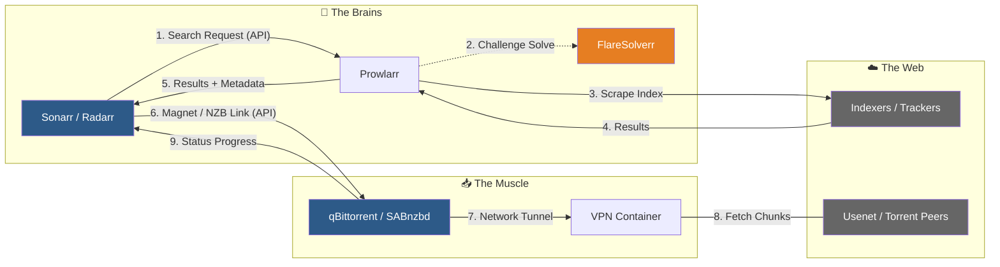
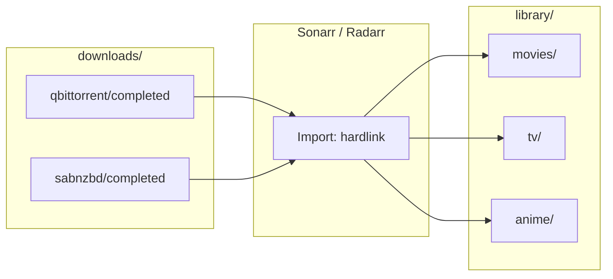

# Chapter 2C – Media VM (220)

## Introduction

If the Core VM protects identity, routing, and stability — the Media VM runs automation.

This VM is not infrastructure in the traditional sense. It is a pipeline.

Content is tracked. Indexers are queried. Files are downloaded. Media is imported. Torrents are seeded. Notifications are sent. And occasionally, something breaks.

That is expected.

This chapter is not about building the “perfect media server.” It is about building a media automation system that:

- Contains operational noise  
- Preserves seeding correctly  
- Exposes only what is necessary  
- Can be rebuilt without drama  

Two principles guide this VM:

> ### 🧠 Philosophy: Contain complexity; design for rebuild
> Understand the complexity — then contain it. Design for rebuild, not for perfection.

We will not chase cleverness for its own sake.  
We will build something correct, understandable, and isolated.

This chapter assumes the [VM overview (Chapter 2)](Chapter2-vms.md) and, for reverse proxy and SSO, the [Core VM (Chapter 2A)](Chapter2a-core.md).

---

## Table of contents
- [Media Stack Overview (Quick Reference)](#media-stack-overview-quick-reference)
- [Why a Dedicated Media VM?](#why-a-dedicated-media-vm)
- [What Lives in the Media VM](#what-lives-in-the-media-vm)
- [VPN Enforcement](#vpn-enforcement)
- [Storage Design](#storage-design)
- [Optional Capability Layers](#optional-capability-layers)
- [How Optional Services Stay Optional](#how-optional-services-stay-optional)
- [Access Model](#access-model)
- [Backup and rebuild](#backup-and-rebuild)
- [Why This VM Is Allowed to Break](#why-this-vm-is-allowed-to-break)
- [FAQ](#faq)

---

## Media Stack Overview (Quick Reference)

The Media VM evolves in capability layers.

The numbers below are not timelines — they are **optional capability sets**.  
You may implement all of them, none of them, or grow into them over time.

---

### Core Automation Pipeline

| App | Role |
|-----|------|
| Sonarr | TV automation |
| Radarr | Movie automation |
| Prowlarr | Centralized indexer management |
| qBittorrent | Torrent download engine |
| VPN container | Network isolation for torrent traffic |
| FlareSolverr | Anti-bot helper for protected indexers |

This is the minimum viable pipeline.

---

### Configuration Discipline Layer

| App | Role |
|-----|------|
| Buildarr | Declarative *arr configuration |
| Recyclarr | Quality profile synchronization |
| Cleanuparr | Automatic queue cleanup |

These tools reduce configuration drift and operational mess.

---

### Enhancements Layer

| App | Role |
|-----|------|
| SABnzbd | Usenet download client |
| Bazarr | Subtitle automation |
| ntfy | Lightweight completion notifications |

These add redundancy and quality-of-life improvements.

---

## Why a Dedicated Media VM?

Media automation behaves differently than the rest of the homelab:

- Torrent clients maintain many active connections.
- Indexers fail unpredictably.
- Disk I/O fluctuates.
- External APIs change.
- Queues stall.
- Anti-bot protection evolves.

This is fundamentally different from:

- Reverse proxy  
- DNS  
- SSO  
- Monitoring  

Those services must remain stable.

The Media VM is isolated because:

- It is expected to change.
- It is allowed to be noisy.
- It may need to be rebuilt.
- It interacts with less predictable external systems.

If something here breaks, public access and authentication must remain intact.

That boundary is intentional.

> ### 🧠 Philosophy: Isolate the noisy workload
> The Media VM is isolated so the rest of the lab stays stable while the media pipeline is allowed to be noisy, change, and be rebuilt.

---

## What Lives in the Media VM

This VM contains the automation engine.

### Core Pipeline Components

- **Sonarr** – TV automation  
- **Radarr** – Movie automation  
- **Prowlarr** – Indexer management  
- **FlareSolverr** – Bypasses Cloudflare protection for supported indexers  
- **VPN container** – Required for torrent routing  
- **qBittorrent** – Torrent client  

This is enough to:

1. Track wanted content  
2. Query indexers  
3. Download via torrent  
4. Import into the media library  
5. Continue seeding  

FlareSolverr exists solely to preserve automation reliability when indexers introduce anti-bot protections. It is not required for all setups, but it prevents brittle automation.

---

### Pipeline flow

The following diagram summarizes the acquisition flow: the *arrs and Prowlarr (the brains), the download clients and VPN (the muscle), and the external indexers and peers (the web). The numbered edges are the main steps — search request → indexer scrape → results → handoff to downloader → fetch via VPN → status back to the *arrs.



---

### Why qBittorrent?

I previously used Deluge and ran into reliability issues.  
qBittorrent integrates cleanly with the *arr ecosystem and is widely adopted.

This guide standardizes on qBittorrent.

---

## VPN Enforcement

Torrent traffic must not exit directly to the internet.

In this setup:

- I use ExpressVPN  
- Any VPN provider can work  
- Torrent traffic is routed through a VPN container  
- The torrent container attaches via:

```yaml
network_mode: service:vpn
```

Bootstrap validates that torrent traffic is routed through the VPN and warns if it is not.

The enforcement is architectural — not vendor-specific.

Torrenting without a VPN is strongly discouraged.

---

## Storage Design

Media storage is structured around a single root directory:

```text
/mnt/media
```

This directory represents the entire media workspace.

Inside it, we separate responsibilities clearly:

```text
/mnt/media/
├── downloads/
│   ├── qbittorrent/
│   │   ├── completed/
│   │   └── incomplete/
│   │
│   └── sabnzbd/
│       ├── completed/
│       ├── intermediate/
│       └── tmp/
│
└── library/
    ├── movies/
    ├── tv/
    └── anime/
```

### Directory Roles

**downloads/**  
Staging area for all download clients.  
This entire directory is mounted into:

- qBittorrent  
- SABnzbd (when enabled)  
- Sonarr  
- Radarr  

Each downloader manages its own internal workspace, but everything remains contained under `/mnt/media/downloads`.

- `qbittorrent/completed/`  
  Fully downloaded torrents.  
  • Written by: qBittorrent  
  • Monitored by: Sonarr / Radarr  

  When a download finishes, the downloader notifies the *arr application via API.  
  Sonarr or Radarr then updates the release status and performs the import by creating a hardlink into the appropriate `/library/...` path based on the show or movie metadata. The original file remains in `downloads/` so the torrent can continue seeding.

- `qbittorrent/incomplete/`  
  Active torrent downloads still in progress.  
  • Used only by: qBittorrent  

- `sabnzbd/completed/`  
  Fully downloaded and unpacked Usenet content.  
  • Written by: SABnzbd  
  • Monitored by: Sonarr / Radarr  

  When complete, Sonarr or Radarr imports the file by creating a hardlink into the correct `/library/...` location, just like with torrents.

- `sabnzbd/intermediate/`  
  Temporary directory used while assembling Usenet articles.  
  • Used internally by: SABnzbd only  

- `sabnzbd/tmp/`  
  Working directory used during repair and extraction.  
  • Used internally by: SABnzbd only  

Only the `completed/` directories are consumed by the *arr applications.  
The rest are internal to the downloader and should never be exposed to Plex.

---

**library/**  
Final organized media.  
This entire directory is mounted into:

- Sonarr  
- Radarr  
- Plex (or other media server)

Inside `library/` content is separated by media type:

- `movies/`   → Shared with Plex as the Movies library  
- `tv/`       → Shared with Plex as the TV library  
- `anime/`    → Optional separate category  

Only the `library/` directory is exposed to Plex.  
Download directories are never shared directly with the media server.

---

### Why Mount the Entire `media/` Directory?

The entire `/mnt/media` directory is mounted as a single filesystem (local disk or NFS).

This is important.

Downloads and library must exist on the same underlying filesystem so that:

- Files can be hardlinked instead of copied  
- Torrent seeding continues uninterrupted  
- No duplicate media files are created  
- No unnecessary write amplification occurs  

By mounting the entire `media/` directory together, we:

- Keep storage layout simple  
- Preserve seeding correctness  
- Avoid cross-filesystem copy operations  
- Contain all media-related state in one predictable location  

Data flow from download to library looks like this (hardlinks require the same filesystem):



---

### Local vs NFS

The `.env.example` defaults to local storage for simplicity.

In my setup, `/mnt/media` is an NFS mount backed by HDD storage.

Both approaches work — as long as the entire `media/` directory is mounted together.

The structure remains the same.  
Only the backing storage changes.

---

## Optional Capability Layers

The Media VM evolves in capability sets (see [Media Stack Overview](#media-stack-overview-quick-reference) for the same layers in table form).

These are not required stages — they are modular expansions.

---

### Core Pipeline

Torrent-based automation only.

Learn the system:

- How indexers behave  
- How queues fill  
- How imports work  
- How seeding behaves  

Keep it simple.

---

### Configuration Discipline Layer

Once the system stabilizes, configuration drift appears.

At this stage:

- Buildarr  
- Recyclarr  
- Cleanuparr  

Buildarr and Recyclarr reduce configuration drift.  
Cleanuparr improves operational hygiene.

These tools are discipline layers — not requirements.

---

### Enhancements Layer

- SABnzbd (Usenet support)  
- Bazarr (Subtitles)  
- ntfy (Download-finished notifications)  

Usenet introduces additional complexity and cost.  
Bazarr improves quality of life.  
ntfy is intentionally minimal — alerting belongs in Monitoring.

---

## How Optional Services Stay Optional

The goal is simplicity without hiding structure.

- Base `compose.yml`  
- Overlay files per app:
  - `compose.buildarr-recyclarr.yml`
  - `compose.cleanuparr.yml`
  - `compose.sabnzbd.yml`
  - `compose.bazarr.yml`
  - `compose.ntfy.yml`

`.env` controls which modules are enabled.

Bootstrap reads `.env` and selects overlays accordingly.

Shell functions hide repetitive Compose flags — but the structure remains visible in the repository.

The complexity is contained, not abstracted away.

---

## Access Model

Only the Core VM receives public traffic (80/443).

Media applications are reverse-proxied through Core.

Each application receives its own hostname.

---

### UI Hostnames (SSO Protected)

- `sonarr.domain`
- `radarr.domain`
- `prowlarr.domain`
- `bazarr.domain` (if enabled)
- `sabnzbd.domain` (if enabled)

These are protected by SSO.

---

### API Hostnames (No SSO)

To support nzb360 and similar mobile apps:

- `sonarr-api.domain`
- `radarr-api.domain`
- `prowlarr-api.domain`

These endpoints:

- Use HTTPS  
- Require API keys  
- Are rate-limited at the reverse proxy  

---

### qBittorrent Exception

`qbittorrent.domain`

This endpoint is not behind SSO to support nzb360.

It is the highest-risk exposed surface in this VM.

Mitigations:

- Strong username/password  
- HTTPS only  
- Stricter rate limits than other APIs  
- VPN-routed torrent traffic  

This is a deliberate compromise.

---

## Important Security Note: Public APIs Are a Compromise

Exposing APIs publicly is not ideal.

Even with:

- HTTPS  
- API keys  
- Rate limiting  

Risks remain.

This exposure exists for convenience.

In the future:

- API access will migrate to Tailscale for the small trusted group.  
- Public API hostnames will be closed.  
- qBittorrent will no longer be publicly accessible.  

This is a staged security posture — not the final one.

---

## Backup and rebuild

Before major upgrades or rebuilds, back up:

- **Compose and .env** — the stack definition and enabled modules.
- ***arr configs** — Sonarr/Radarr/Prowlarr (and optional apps) export or config directories; many *arrs support backup/restore from the UI.
- **Optionally:** application databases if you rely on local DBs rather than config-only state.

**What survives without backup:** The media library lives on NAS (or wherever `/mnt/media/library` is mounted). If the Media VM is rebuilt, you reattach the same mount, restore compose and config (or reconfigure from scratch), and the library is unchanged. Seeding can resume once the download client points at the same `downloads/` paths.

This is why we "design for rebuild": automation state is reproducible; the valuable data is elsewhere.

---

## Why This VM Is Allowed to Break

Automation state is reproducible.

Libraries are external.

Configuration lives in files.

Optional tools are modular.

If the Media VM becomes unstable:

- It can be rebuilt.  
- The media library remains intact.  
- Seeding can resume.  
- The rest of the infrastructure remains unaffected.  

The Media VM is dynamic by design.

> ### 🧠 Tradeoff: Reproducible automation over perfect uptime
> Automation state is reproducible, libraries are external, and config lives in files — so we accept that this VM may be rebuilt in exchange for keeping the rest of the lab stable.

---

## FAQ

### Why use hardlinks instead of simple copy/move?

Because proper torrent seeding requires it.

If downloads and library share the same filesystem, hardlinks allow the file to be organized into the library without duplicating data, while the torrent client continues seeding.

Without this, imports would require copying or moving the file, which either duplicates storage or interrupts seeding.

---

### Can hardlinks work over NFS?

Yes — as long as downloads and library are on the same underlying filesystem within the same mount/export.

Hardlinks do not work across different filesystems.

---

### Why expose public APIs at all?

To support mobile apps like nzb360 without requiring every user to configure Tailscale.

It is a tradeoff between convenience and strict isolation.

Mitigations exist — but it remains a compromise.

---

### Why not keep the torrent client local-only?

Remote visibility and control are practical needs.

Monitoring progress, managing stalled torrents, and interacting via mobile apps are legitimate use cases.

The exposure is intentional and documented — not accidental.

---

### What happens if an API key leaks?

An attacker could control the associated application.

Mitigations:

- Rotate the key  
- Disable the exposed hostname  
- Audit logs  
- Migrate to Tailscale access  

This is another reason public API exposure is treated as temporary.