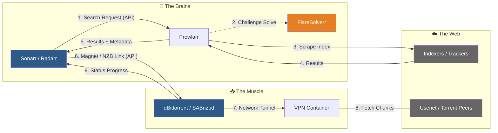
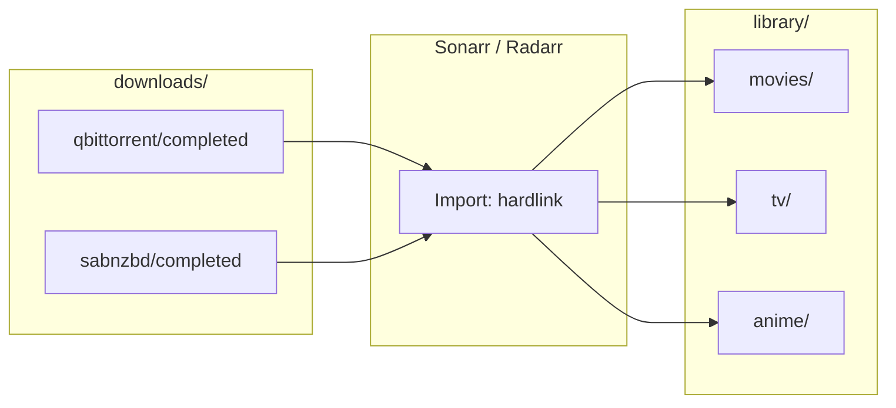

# Chapter 2C – Media VM (220)

## Introduction

If the Core VM protects identity, routing, and stability — the Media VM runs automation.

This VM is not infrastructure in the traditional sense. It is a pipeline.

Content is tracked. Indexers are queried. Files are downloaded. Media is imported. Torrents are seeded. Notifications are sent. And occasionally, something breaks.

That is expected.

This chapter is not about building the “perfect media server.” It is about building a media automation system that:

- Contains operational noise  
- Preserves seeding correctly  
- Exposes only what is necessary  
- Can be rebuilt without drama  

Two principles guide this VM:

> ### 🧠 Philosophy: Contain complexity; design for rebuild
> Understand the complexity — then contain it. Design for rebuild, not for perfection.

We will not chase cleverness for its own sake.  
We will build something correct, understandable, and isolated.

This chapter assumes the [VM overview (Chapter 2)](Chapter2-vms.md) and, for reverse proxy and SSO, the [Core VM (Chapter 2A)](Chapter2a-core.md).

**Configuration reference:** Paths, categories, naming, and quality in this chapter follow the [TRaSH Guides](https://trash-guides.info/) (file/folder structure, qBittorrent, SABnzbd, Sonarr, Radarr, Prowlarr, Bazarr, Plex). TRaSH is the gold standard for a correct, maintainable pipeline. Actual compose layout, environment variables, deployment workflow, and step-by-step UI configuration are covered in **[Chapter 3c](Chapter3c-media-stack.md)** (media stack deployment).

---

## Table of contents
- [Media Stack Overview (Quick Reference)](#media-stack-overview-quick-reference)
- [Why a Dedicated Media VM?](#why-a-dedicated-media-vm)
- [What Lives in the Media VM](#what-lives-in-the-media-vm)
- [VPN Enforcement](#vpn-enforcement)
- [Storage Design](#storage-design)
  - [Path layout and TRaSH alignment](#path-layout-and-trash-alignment)
  - [Single root in containers (no remote path mapping)](#single-root-in-containers-no-remote-path-mapping)
  - [Naming and quality](#naming-and-quality)
  - [Quality and codec (Golden Rule)](#quality-and-codec-golden-rule)
- [Optional Capability Layers](#optional-capability-layers)
- [How Optional Services Stay Optional](#how-optional-services-stay-optional)
- [Access Model](#access-model)
- [Backup and rebuild](#backup-and-rebuild)
- [Why This VM Is Allowed to Break](#why-this-vm-is-allowed-to-break)
- [FAQ](#faq)

---

## Media Stack Overview (Quick Reference)

The Media VM evolves in capability layers.

The numbers below are not timelines — they are **optional capability sets**.  
You may implement all of them, none of them, or grow into them over time.

---

### Core Automation Pipeline

| App | Role |
|-----|------|
| Sonarr | TV automation |
| Radarr | Movie automation |
| Prowlarr | Centralized indexer management |
| qBittorrent | Torrent download engine |
| VPN container | Network isolation for torrent traffic |
| FlareSolverr | Anti-bot helper for protected indexers |

This is the minimum viable pipeline.

---

### Configuration Discipline Layer

| App | Role |
|-----|------|
| Recyclarr | Quality profile synchronization |
| Cleanuparr | Automatic queue cleanup |

These tools reduce configuration drift and operational mess. Recyclarr (and alternatives like Configarr) follow the [TRaSH Guide Sync](https://trash-guides.info/Guide-Sync/) approach: they sync Custom Formats, Quality Profiles, and quality definitions from TRaSH into Sonarr and Radarr so the pipeline stays aligned with the guides. Recyclarr is driven by **YAML config** (`recyclarr.yml`); when enabled, **most of the manual Sonarr/Radarr UI configuration in [Chapter 3c](Chapter3c-media-stack.md) can be skipped** (quality settings, custom formats, quality profiles). Root folders, download clients, TRaSH naming, and Prowlarr app sync are handled by `setup_media_apps.py` via API on every deploy. Example YAML configs live in `docker_compose/media/` (`recyclarr.example.yml`, `recyclarr.secrets.example.yml`); **bootstrap copies them into the config dirs when enabled and the target is missing** (like `.env` from `.env.example`). Cleanuparr handles queue and download hygiene (stalled items, orphans). How to enable and configure them is in [Chapter 3c](Chapter3c-media-stack.md).

---

### Enhancements Layer

| App | Role |
|-----|------|
| SABnzbd | Usenet download client |
| Bazarr | Subtitle automation |
| ntfy | Lightweight completion notifications |

These add redundancy and quality-of-life improvements. Bazarr uses the **same path root** as Sonarr and Radarr so it can see library paths and write subtitle files (e.g. `.srt`) next to media; that aligns with [TRaSH Bazarr](https://trash-guides.info/Bazarr/) (“paths must match the same root”). When enabled (`ENABLE_BAZARR=1`), deploy configures Bazarr automatically via its API — Sonarr/Radarr connections, language profile (English + Hebrew), subtitle providers, TRaSH scoring, and adaptive searching. Configuration details are in [Chapter 3c](Chapter3c-media-stack.md).

---

## Why a Dedicated Media VM?

Media automation behaves differently than the rest of the homelab:

- Torrent clients maintain many active connections.
- Indexers fail unpredictably.
- Disk I/O fluctuates.
- External APIs change.
- Queues stall.
- Anti-bot protection evolves.

This is fundamentally different from:

- Reverse proxy  
- DNS  
- SSO  
- Monitoring  

Those services must remain stable.

The Media VM is isolated because:

- It is expected to change.
- It is allowed to be noisy.
- It may need to be rebuilt.
- It interacts with less predictable external systems.

If something here breaks, public access and authentication must remain intact.

That boundary is intentional.

> ### 🧠 Philosophy: Isolate the noisy workload
> The Media VM is isolated so the rest of the lab stays stable while the media pipeline is allowed to be noisy, change, and be rebuilt.

---

## What Lives in the Media VM

This VM contains the automation engine.

### Core Pipeline Components

- **Sonarr** – TV automation  
- **Radarr** – Movie automation  
- **Prowlarr** – Indexer management  
- **FlareSolverr** – Bypasses Cloudflare protection for supported indexers  
- **VPN container** – Required for torrent routing  
- **qBittorrent** – Torrent client  

This is enough to:

1. Track wanted content  
2. Query indexers  
3. Download via torrent  
4. Import into the media library  
5. Continue seeding  

FlareSolverr exists solely to preserve automation reliability when indexers introduce anti-bot protections. It is not required for all setups, but it prevents brittle automation.

---

### Pipeline flow

The following diagram summarizes the acquisition flow: the *arrs and Prowlarr (the brains), the download clients and VPN (the muscle), and the external indexers and peers (the web). The numbered edges are the main steps — search request → indexer scrape → results → handoff to downloader → fetch via VPN → status back to the *arrs.


```mermaid
graph LR
    subgraph Brains ["🧠 The Brains"]
        Arrs[Sonarr / Radarr]
        Prowlarr[Prowlarr]
        Flare[FlareSolverr]
    end

    subgraph Web ["☁️ The Web"]
        Indexers[Indexers / Trackers]
        Peers[Usenet / Torrent Peers]
    end

    subgraph Muscle ["📥 The Muscle"]
        qBit[qBittorrent / SABnzbd]
        VPN[VPN Container]
    end

    %% The Acquisition Flow
    Arrs -- "1. Search Request (API)" --> Prowlarr
    Prowlarr -. "2. Challenge Solve" .-> Flare
    Prowlarr -- "3. Scrape Index" --> Indexers
    Indexers -- "4. Results" --> Prowlarr
    Prowlarr -- "5. Results + Metadata" --> Arrs

    %% The Handshake
    Arrs -- "6. Magnet / NZB Link (API)" --> qBit

    %% The Data Flow
    qBit -- "7. Network Tunnel" --> VPN
    VPN -- "8. Fetch Chunks" --- Peers

    %% The Status Loop
    qBit -- "9. Status Progress" --> Arrs

    style Arrs fill:#2d5a88,color:#fff
    style qBit fill:#2d5a88,color:#fff
    style Indexers fill:#666,color:#fff
    style Peers fill:#666,color:#fff
    style Flare fill:#e67e22,color:#fff
```

---

### Why qBittorrent?

I previously used Deluge and ran into reliability issues.  
qBittorrent integrates cleanly with the *arr ecosystem and is widely adopted.

This guide standardizes on qBittorrent.

---

## VPN Enforcement

Torrent traffic must not exit directly to the internet.

In this setup, torrent traffic is routed through the VPN container `misioslav/expressvpn`, activated via `EXPRESSVPN_CODE` in `.env`. The torrent container attaches via:

```yaml
network_mode: service:vpn
```

Bootstrap validates VPN credentials and warns if `EXPRESSVPN_CODE` is not set. See the [expressvpn GitHub repo](https://github.com/Misioslav/expressvpn) for setup.

> ### 🧠 Tradeoff: ExpressVPN-specific container vs provider-agnostic Gluetun
> [Gluetun](https://github.com/qdm12/gluetun) is the standard generic VPN container (supports 60+ providers). However, ExpressVPN dropped straightforward OpenVPN credential-based setup — configuring it now requires manually downloading `.ovpn` files, which cannot be automated. Switching to [`misioslav/expressvpn`](https://github.com/Misioslav/expressvpn) trades provider flexibility for a simpler activation flow: provide an activation `CODE` and the container handles the rest. This makes the stack ExpressVPN-specific, but the architectural pattern (`network_mode: service:vpn`) is unchanged — switching back to Gluetun or another VPN container only requires replacing the `vpn` service definition in `compose.yml`.

**Key features** of the ExpressVPN container: no `--privileged` required (just `NET_ADMIN` + `SYS_PTRACE` capabilities); built-in healthcheck with supervision loop (qBittorrent uses `condition: service_healthy`); Prometheus metrics exporter on port 9797 (scraped by monitoring VM); default protocol `lightwayudp` (ExpressVPN's fastest); Network Lock enabled by default (kill switch prevents leaks).

Torrenting without a VPN is strongly discouraged.

---

## Storage Design

Storage follows the lab rule: each VM mounts only what it needs (see [Chapter 2 — Boundary rules](Chapter2-vms.md#vm-by-vm-the-boundary-rules-the-important-part)). For the media VM, that means a single root directory:

```text
/mnt/media
```

This directory represents the entire media workspace.

Inside it, we separate responsibilities clearly. Under each download client’s `completed/` folder we use **category subfolders** (`tv`, `movies`) so Sonarr and Radarr can track downloads by type. This layout aligns with the [TRaSH Guides – File and Folder Structure](https://trash-guides.info/File-and-Folder-Structure/).

```text
/mnt/media/
├── downloads/
│   ├── qbittorrent/
│   │   ├── completed/
│   │   │   ├── tv/
│   │   │   └── movies/
│   │   └── incomplete/
│   │
│   └── sabnzbd/
│       ├── completed/
│       │   ├── tv/
│       │   └── movies/
│       ├── intermediate/
│       └── tmp/
│
└── library/
    ├── movies/
    ├── tv/
    └── anime/
```

### Directory Roles

**downloads/**  
Staging area for all download clients.  
This entire directory is mounted into:

- qBittorrent  
- SABnzbd (when enabled)  
- Sonarr  
- Radarr  

Each downloader manages its own internal workspace, but everything remains contained under `/mnt/media/downloads`.

- `qbittorrent/completed/` (with subfolders `tv/`, `movies/`)  
  Fully downloaded torrents, organized by category so Sonarr watches only `completed/tv/` and Radarr only `completed/movies/`.  
  • Written by: qBittorrent  
  • Monitored by: Sonarr / Radarr  

  When a download finishes, the downloader notifies the *arr application via API.  
  Sonarr or Radarr then updates the release status and performs the import by creating a hardlink into the appropriate `/library/...` path based on the show or movie metadata. The original file remains in `downloads/` so the torrent can continue seeding.  
  **Required:** In qBittorrent, set **Default Torrent Management Mode** to **Automatic** so completed files land in the category subfolders; otherwise they can end up in the root of `completed/` and *arr tracking breaks.

- `qbittorrent/incomplete/`  
  Active torrent downloads still in progress.  
  • Used only by: qBittorrent  

- `sabnzbd/completed/` (with subfolders `tv/`, `movies/`)  
  Fully downloaded and unpacked Usenet content, again by category.  
  • Written by: SABnzbd  
  • Monitored by: Sonarr / Radarr  

  When complete, Sonarr or Radarr imports the file by creating a hardlink into the correct `/library/...` location, just like with torrents. Configure SABnzbd categories so content lands in these subfolders.

- `sabnzbd/tmp/`  
  Temporary directory used while assembling, repairing, and extracting Usenet articles.  
  • Used internally by: SABnzbd only  

Only the `completed/` directories (and their category subfolders) are consumed by the *arr applications.  
The rest are internal to the downloader and should never be exposed to Plex.

---

**library/**  
Final organized media.  
This entire directory is mounted into:

- Sonarr  
- Radarr  
- Plex (or other media server)

Inside `library/` content is separated by media type:

- `movies/`   → Shared with Plex as the Movies library  
- `tv/`       → Shared with Plex as the TV library  
- `anime/`    → Optional separate category  

Only the `library/` directory is exposed to Plex.  
Download directories are never shared directly with the media server.

---

### Path layout and TRaSH alignment

We use one host root (`/mnt/media`) and, in containers, one path root (e.g. `/data`) so every app sees the same paths. That avoids remote path mapping and matches [TRaSH](https://trash-guides.info/File-and-Folder-Structure/): same filesystem, consistent view.

- **Why “downloads” and “library” instead of TRaSH’s “torrents”, “usenet”, “media”?**  
  We keep one conceptual split (staging vs final) and group both torrent and Usenet under `downloads/` with client subfolders (`qbittorrent/`, `sabnzbd/`). Functionally equivalent: one root, downloads separate from library, same filesystem.

- **Why client subfolders under downloads?**  
  Keeps each download client’s workspace separate while sharing the same root. TRaSH uses separate top-level `torrents` and `usenet`; we use `downloads/qbittorrent` and `downloads/sabnzbd` so the layout stays flat under one `downloads/` tree.

- **Why category subfolders (tv, movies) under completed?**  
  So Sonarr only watches `.../completed/tv/` and Radarr only `.../completed/movies/`. That avoids cross-talk, matches what *arrs expect, and aligns with TRaSH’s category-based layout. In qBittorrent you set categories with save paths relative to the default (e.g. `completed/tv`, `completed/movies`); in SABnzbd, categories are relative to the completed folder. Step-by-step configuration is in [Chapter 3c](Chapter3c-media-stack.md).

---

### Single root in containers (no remote path mapping)

If every container that touches media mounts the same host path (e.g. `/mnt/media`) to the **same** path inside the container (e.g. `/data`), then qBittorrent reports “file at `/data/downloads/qbittorrent/completed/tv/ShowName`” and Sonarr sees that exact path. No remote path mapping is needed.

TRaSH recommends this: *“Pick one root and use it for every app.”* Giving every app the same root does not grant “too much” access—it’s the intended design. *arrs need to see both download and library paths to import; the download client only writes under its own directory. The actual compose change (single mount per service) is in [Chapter 3c](Chapter3c-media-stack.md).

---

### Naming and quality

**Naming**  
Sonarr and Radarr must use a naming scheme that includes **non-recoverable information** in filenames: repack/proper, edition (e.g. Director’s Cut), release group, and quality source (HDTV, WEB-DL, Blu-ray, Remux). Without that, the *arrs can’t tell different releases apart and may re-download or re-import the same content, causing loops and duplicate work. We follow the [TRaSH-recommended naming schemes](https://trash-guides.info/) for Sonarr and Radarr; exact templates and where to set them are in [Chapter 3c](Chapter3c-media-stack.md).

**Quality settings**  
TRaSH recommends configuring quality settings (file size), quality profiles, and custom formats in a defined order so low-quality or fake releases are avoided and the right codec/resolution choices are enforced. That configuration is covered in [Chapter 3c](Chapter3c-media-stack.md); the reasoning for the “Golden Rule” is below.

**Anime and English subtitles**  
The anime pipeline uses a three-layer strategy to ensure English-subtitled releases:

1. **Indexer filtering** — Nyaa.si is configured with the “Anime - English-translated” category so raw Japanese-only releases are filtered out before Sonarr sees them. Ref: [TRaSH Anime FAQ](https://trash-guides.info/Sonarr/sonarr-setup-quality-profiles-anime/#faq).
2. **Custom Format scoring** — Recyclarr syncs the TRaSH `[Anime] Remux-1080p` profile with `Anime Raws` at −10000 (blocked) and `Dubs Only` at −10000, plus the `[Streaming Services] Asian` CF group to correctly score Crunchyroll/Funimation/HIDIVE web releases.
3. **Naming** — The anime naming format includes `{MediaInfo AudioLanguages}` (shows `[JA]`) and `{MediaInfo VideoBitDepth}bit` (shows `10bit`) so you can visually confirm Japanese audio and 10-bit encoding in filenames.

---

### Quality and codec (Golden Rule)

TRaSH’s [x265 and 4K Golden Rule](https://trash-guides.info/Misc/x265-4k/) is:

- **720p and 1080p** → prefer **x264** (AVC).
- **2160p / 4K** → use **x265** (HEVC).

The reason: many 1080p x265 releases are low-bitrate re-encodes from x264 and look worse. x265 is recommended for 4K and for 1080p when the source is good (e.g. HDR from a remux). We enforce this via Quality Profiles and Custom Formats in Sonarr and Radarr (and optionally via Recyclarr or other Guide Sync tools). How to set that up is in [Chapter 3c](Chapter3c-media-stack.md).

---

### Why Mount the Entire `media/` Directory?

The entire `/mnt/media` directory is mounted as a single filesystem (local disk or NFS).

This is important.

Downloads and library must exist on the same underlying filesystem so that:

- Files can be hardlinked instead of copied  
- Torrent seeding continues uninterrupted  
- No duplicate media files are created  
- No unnecessary write amplification occurs  

By mounting the entire `media/` directory together, we:

- Keep storage layout simple  
- Preserve seeding correctness  
- Avoid cross-filesystem copy operations  
- Contain all media-related state in one predictable location  

Data flow from download to library looks like this (hardlinks require the same filesystem):


```mermaid
flowchart LR
    subgraph downloads ["downloads/"]
        QC[qbittorrent/completed]
        SC[sabnzbd/completed]
    end

    subgraph arrs ["Sonarr / Radarr"]
        Import[Import: hardlink]
    end

    subgraph library ["library/"]
        Movies[movies/]
        TV[tv/]
        Anime[anime/]
    end

    QC --> Import
    SC --> Import
    Import --> Movies
    Import --> TV
    Import --> Anime
```

---

### Local vs NFS

The `.env.example` defaults to local storage for simplicity.

In my setup, `/mnt/media` is an NFS mount backed by HDD storage.

Both approaches work — as long as the entire `media/` directory is mounted together.

The structure remains the same.  
Only the backing storage changes.

---

## Optional Capability Layers

The Media VM evolves in capability sets (see [Media Stack Overview](#media-stack-overview-quick-reference) for the same layers in table form).

These are not required stages — they are modular expansions.

---

### Core Pipeline

Torrent-based automation only.

Learn the system:

- How indexers behave  
- How queues fill  
- How imports work  
- How seeding behaves  

Keep it simple.

---

### Configuration Discipline Layer

Once the system stabilizes, configuration drift appears.

At this stage:

- Recyclarr  
- Cleanuparr  

`setup_media_apps.py` runs on every deploy and configures root folders, download clients, TRaSH naming, and Prowlarr app sync via API. Without it, those settings would need manual UI configuration, defeating the goal of a one-command deploy.

Recyclarr is **optional but enabled by default** (`ENABLE_RECYCLARR=1` in `.env.example`). It runs as a daemon on a configurable `CRON_SCHEDULE` (default `@weekly`), syncing TRaSH quality profiles — including anime — to keep your *arr apps current as the guides update (new bad-encoder patterns, score adjustments, format changes).  
Cleanuparr improves operational hygiene.

These tools are discipline layers. `setup_media_apps.py` is required for a working deploy; Recyclarr's default-on posture means a fresh deploy gets TRaSH-aligned quality profiles and custom formats out of the box.

---

### Enhancements Layer

- SABnzbd (Usenet support)  
- Bazarr (Subtitles)  
- ntfy (Download-finished notifications)  

Usenet introduces additional complexity and cost.  
Bazarr improves quality of life.  
ntfy is intentionally minimal — alerting belongs in Monitoring.

---

### Usenet: why add a second protocol at all?

Torrents and Usenet fail in *uncorrelated* ways, which is the whole point of running both. A torrent dies when nobody is seeding it — an availability problem that gets worse with age. A Usenet article dies when it is taken down or was posted incomplete — a retention problem that has nothing to do with popularity. Old, obscure content that has no seeders is often trivially available on Usenet, and vice versa. Running both turns two lossy sources into one fairly reliable one.

The operational differences that shape the design:

| | Torrent (qBittorrent) | Usenet (SABnzbd) |
|---|---|---|
| Transport | Peer-to-peer, IP-visible to swarm | Client → provider over TLS |
| Needs the VPN? | **Yes** — traffic is visible to every peer | **No** — it is a private TLS connection to a paid provider |
| Speed | Depends on seeders | Usually line rate |
| Cost | Free | Provider subscription **+** indexer |
| Fails when | No seeders | Articles missing/taken down |
| Obligations | Seeding ratio/time | None — download and you're done |

This is why SABnzbd **does not** run behind the VPN container. qBittorrent uses `network_mode: service:vpn` because a torrent swarm exposes your IP to every peer. Usenet is a straightforward TLS connection to a provider you already pay by name — routing it through the VPN would add latency and a failure mode to buy nothing. Usenet also has no seeding obligation, so nothing lingers after import.

> ### 🧠 Philosophy: Protocol Preference Is Not Client Priority
> Making the *arrs prefer Usenet is done with a **delay profile**, not by ranking download clients. Client priority only breaks ties between clients of the *same* protocol; it has zero influence on usenet-vs-torrent. The stack sets `preferredProtocol: usenet` with a 60-minute torrent delay, so a torrent must age past the window before it is eligible — giving Usenet first refusal. Operational detail in [Chapter 3C](Chapter3c-media-stack.md#sabnzbd-optional--usenet).

#### Where the temp directory lives (an accepted trade-off)

SABnzbd downloads into a temp dir, then repairs (par2) and unpacks before moving the result to the completed folder. Two moves, with opposite requirements:

1. **temp → completed** — internal to SABnzbd. Same filesystem = instant rename; cross-filesystem = a full copy.
2. **completed → library** — done by Sonarr/Radarr on import. **This** is the one that needs hardlinks, and it is why the completed folder *must* live on the same mount as the library.

Our layout puts both under `MEDIA_ROOT` (the NAS, over NFS). That makes move #2 an instant hardlink, which is non-negotiable. The cost is that par2 repair and unpack — which are random-IO heavy — happen over NFS rather than on local disk.

**This is a known, accepted trade-off, not an oversight.** The alternative (temp on the VM's local SSD) makes repair/unpack much faster and is the usual recommendation, but it converts move #1 into a full copy over the network and, more importantly, the media VM's local disk currently has ~42 GB free — not enough headroom for a large 4K remux job, which would fail mid-unpack. Correctness beats speed here. Revisit if unpack throughput becomes a real bottleneck; the fix is to grow the media VM's disk first, *then* move the temp dir.

---

## How Optional Services Stay Optional

The goal is simplicity without hiding structure.

- **Base:** `docker_compose/media/compose.yml` (core pipeline only).  
- **Overlay files** in the same directory:
  - `compose.recyclarr.yml`
  - `compose.cleanuparr.yml`
  - `compose.sabnzbd.yml`
  - `compose.bazarr.yml`
  - `compose.ntfy.yml`

`.env` is the single place to declare intent: set `ENABLE_RECYCLARR=1`, `ENABLE_CLEANUPARR=1`, `ENABLE_SABNZBD=1`, `ENABLE_BAZARR=1`, `ENABLE_NTFY=1` as needed. After deploy, a shell helper (`media`) picks the right compose files from these so you don’t type multiple `-f` by hand; the overlays stay visible in the repo.

Deploy the media stack by creating `.env` from `.env.example` in `docker_compose/media/`, then running `python3 deploy.py media` from the repo root. A **bootstrap script** in `docker_compose/media/` is invoked by deploy and handles optional NFS, config dirs, and *arr config pre-seeding. After `docker compose up`, `deploy.py` automatically:

- Pre-seeds *arr `config.xml` with External auth and generated API keys
- Pre-seeds `qBittorrent.conf` with a known WebUI password (so automation and exporters can authenticate)
- Runs `setup_media_apps.py` — adds Prowlarr indexers (13 public torrent sites) and a FlareSolverr proxy, configures qBittorrent categories (`tv`, `movies`, `anime`) and [TRaSH-recommended settings](https://trash-guides.info/Downloaders/qBittorrent/Basic-Setup/) (TCP protocol, encryption, seeding limits, UPnP, CSRF), sets up Sonarr/Radarr root folders + download clients + TRaSH naming, and connects Prowlarr app sync to Sonarr/Radarr — all via API
- Triggers an initial Recyclarr sync (TRaSH quality profiles including anime) when enabled — Recyclarr then continues as a daemon on its configured cron schedule
- Auto-populates exporter API keys in `.env` from config.xml (for Prometheus scraparr)

This means a fresh deploy produces a working pipeline with minimal manual UI work. **Compose layout, environment variables, and step-by-step UI configuration** are in [Chapter 3c](Chapter3c-media-stack.md) (media stack deployment). For the core stack, see [Chapter 3A — Core stack](Chapter3a-core-stack.md).

> ### 🧠 Philosophy: Automated Setup, Recyclarr Optional
> `setup_media_apps.py` is required because without it, root folders, download clients, TRaSH naming, and Prowlarr app sync would need manual UI configuration — defeating the goal of a one-command deploy. Recyclarr is optional but enabled by default: TRaSH Guides update quality profiles periodically (new bad-encoder patterns, score adjustments, format changes), and Recyclarr keeps your *arr apps current without manual intervention. If you prefer to manage quality profiles manually, set `ENABLE_RECYCLARR=0`.

---

## Access Model

Only the Core VM receives public traffic (80/443).

Media applications are reverse-proxied through Core.

Each application receives its own hostname.

---

### UI Hostnames (SSO Protected)

- `sonarr.<PUBLIC_BASE_DOMAIN>`
- `radarr.<PUBLIC_BASE_DOMAIN>`
- `prowlarr.<PUBLIC_BASE_DOMAIN>`
- `bazarr.<PUBLIC_BASE_DOMAIN>` (if enabled)
- `sabnzbd.<PUBLIC_BASE_DOMAIN>` (if enabled)

These are protected by SSO. `<PUBLIC_BASE_DOMAIN>` is set in the core stack `.env` (e.g. `example.com`).

---

### API Hostnames (No SSO)

To support nzb360 and similar mobile apps:

- `sonarr-api.<PUBLIC_BASE_DOMAIN>`
- `radarr-api.<PUBLIC_BASE_DOMAIN>`
- `prowlarr-api.<PUBLIC_BASE_DOMAIN>`

These endpoints:

- Use HTTPS  
- Require API keys  
- Are rate-limited at the reverse proxy  

---

### qBittorrent Exception

`qbittorrent.<PUBLIC_BASE_DOMAIN>`

This endpoint is not behind SSO to support nzb360.

It is the highest-risk exposed surface in this VM.

Mitigations:

- Strong username/password  
- HTTPS only  
- Stricter rate limits than other APIs  
- VPN-routed torrent traffic  

This is a deliberate compromise.

---

## Important Security Note: Public APIs Are a Compromise

Exposing APIs publicly is not ideal.

Even with:

- HTTPS  
- API keys  
- Rate limiting  

Risks remain.

This exposure exists for convenience.

In the future:

- API access will migrate to Tailscale for the small trusted group.  
- Public API hostnames will be closed.  
- qBittorrent will no longer be publicly accessible.  

This is a staged security posture — not the final one.

---

## Backup and rebuild

Before major upgrades or rebuilds, back up:

- **Compose and .env** — the stack definition and enabled modules.
- ***arr configs** — Sonarr/Radarr/Prowlarr (and optional apps) export or config directories; many *arrs support backup/restore from the UI.
- **Optionally:** application databases if you rely on local DBs rather than config-only state.

**What survives without backup:** The media library lives on NAS (or wherever `/mnt/media/library` is mounted). If the Media VM is rebuilt, you reattach the same mount, restore compose and config (or reconfigure from scratch), and the library is unchanged. Seeding can resume once the download client points at the same `downloads/` paths.

This is why we "design for rebuild": automation state is reproducible; the valuable data is elsewhere.

---

## Why This VM Is Allowed to Break

Automation state is reproducible.

Libraries are external.

Configuration lives in files.

Optional tools are modular.

If the Media VM becomes unstable:

- It can be rebuilt.  
- The media library remains intact.  
- Seeding can resume.  
- The rest of the infrastructure remains unaffected.  

The Media VM is dynamic by design.

> ### 🧠 Tradeoff: Reproducible automation over perfect uptime
> Automation state is reproducible, libraries are external, and config lives in files — so we accept that this VM may be rebuilt in exchange for keeping the rest of the lab stable.

---

## FAQ

### Why use hardlinks instead of simple copy/move?

Because proper torrent seeding requires it.

If downloads and library share the same filesystem, hardlinks allow the file to be organized into the library without duplicating data, while the torrent client continues seeding.

Without this, imports would require copying or moving the file, which either duplicates storage or interrupts seeding.

---

### Can hardlinks work over NFS?

Yes — as long as downloads and library are on the same underlying filesystem within the same mount/export.

Hardlinks do not work across different filesystems.

---

### Why expose public APIs at all?

To support mobile apps like nzb360 without requiring every user to configure Tailscale.

It is a tradeoff between convenience and strict isolation.

Mitigations exist — but it remains a compromise.

---

### Why not keep the torrent client local-only?

Remote visibility and control are practical needs.

Monitoring progress, managing stalled torrents, and interacting via mobile apps are legitimate use cases.

The exposure is intentional and documented — not accidental.

---

### What happens if an API key leaks?

An attacker could control the associated application.

Mitigations:

- Rotate the key  
- Disable the exposed hostname  
- Audit logs  
- Migrate to Tailscale access  

This is another reason public API exposure is treated as temporary.