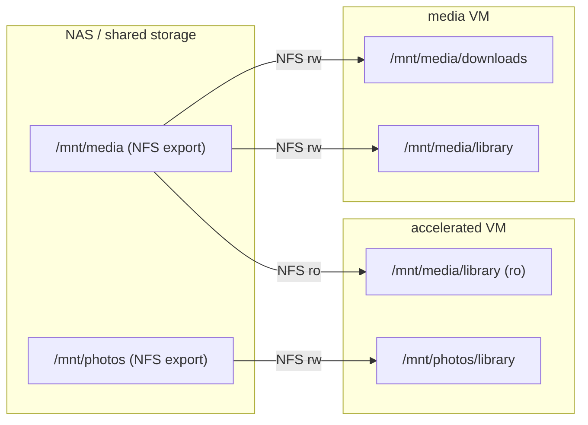

# Chapter 2D – Accelerated VM (230)

## Introduction

If the Media VM runs the **automation pipeline**, the Accelerated VM runs the **playback and compute-heavy workloads**.

Where `media` is about searching, downloading, and organizing, `accelerated` is about:

- Serving that library to clients (Plex)  
- Handling photo/video ingestion and search (Immich)  
- Owning all of the lab’s GPU complexity in one place  

This chapter is not a Plex or Immich tuning guide. It is the **shape of the VM**:

- What lives here (and what does not)  
- How storage is laid out  
- How GPU passthrough is treated  
- How it relates to `media` and the rest of the lab  

The hands-on stack details (`compose.yml`, `.env.example`, bootstrap, deploy workflow) live in **[Chapter 3D](Chapter3d-accelerated-stack.md)**.

> ### 🧠 Philosophy: One Place for Hardware Complexity
> GPU drivers, passthrough, and transcoding behavior are all concentrated in `accelerated`.
> That keeps the Proxmox host boring, other VMs simple, and the “GPU blast radius” small.

This chapter assumes:

- [Chapter 2](Chapter2-vms.md) — VM overview and boundary rules  
- [Chapter 2C](Chapter2c-media.md) — Media pipeline, storage model, and why `/mnt/media` looks the way it does  
- [Chapter 2A](Chapter2a-core.md) — Core VM and how everything is reverse-proxied through it  

---

## Table of contents

- [Why a Dedicated Accelerated VM?](#why-a-dedicated-accelerated-vm)
- [What Lives in the Accelerated VM](#what-lives-in-the-accelerated-vm)
- [Storage Design](#storage-design)
  - [Plex: Library-only, No Downloads](#plex-library-only-no-downloads)
  - [Immich: Separate Photo Library](#immich-separate-photo-library)
  - [How `media` and `accelerated` Share Data](#how-media-and-accelerated-share-data)
- [GPU Design](#gpu-design)
  - [Intel Quick Sync / VAAPI (Default Path)](#intel-quick-sync--vaapi-default-path)
  - [VM-Side GPU Prerequisites](#vm-side-gpu-prerequisites)
  - [Boundary Rules for the GPU](#boundary-rules-for-the-gpu)
- [Access Model](#access-model)
- [Backup and Rebuild](#backup-and-rebuild)
- [FAQ](#faq)

---

## Why a Dedicated Accelerated VM?

GPU workloads behave differently from the rest of the lab:

- Drivers and kernels matter more  
- Upgrades can quietly change behavior (transcoding quality, codec support)  
- Misconfiguration can destabilize the whole host, not just one container  

That is a very different failure mode than:

- Reverse proxy and SSO (`core`)  
- Metrics and logs (`monitoring`)  
- Download automation (`media`)  

Separating these concerns leads to a clear boundary:

- `media` owns the **pipeline** (indexers, downloaders, *arr stack, VPN).  
- `accelerated` owns the **GPU** and **playback/ML workloads** that depend on it.  

If the Accelerated VM breaks:

- The library on NAS is still intact.  
- The *arr pipeline continues to run.  
- The Proxmox host is not running experimental GPU workloads directly.  

> ### 🧠 Tradeoff: Contain Driver Risk, Not Just App Risk
> A bad Plex setting is annoying. A bad GPU driver can lock up the host.
> By keeping GPU passthrough inside `accelerated`, the rest of the lab stays boring
> even while experimenting with codecs, hardware acceleration, and ML.

---

## What Lives in the Accelerated VM

From [Chapter 2 – VM Overview](Chapter2-vms.md#-what-runs-where-quick-reference):

| App    | Tier | What it gives the lab                                   |
|--------|------|---------------------------------------------------------|
| Plex   | Core | Media server: playback + optional hardware transcoding |
| Immich | Core | Photo/video platform with acceleration support         |

This VM is intentionally narrow in scope:

- **Plex**  
  - Reads the organized library produced by `media`  
  - Optionally uses the GPU for transcoding (Intel Quick Sync / VAAPI)  

- **Immich**  
  - Owns its own originals and derived assets  
  - May use the GPU for transcoding and/or machine-learning acceleration  

Future GPU-friendly workloads (e.g. computer vision tools, experimental ML jobs) also belong here, not on `core` or `media`.

---

## Storage Design

The Accelerated VM follows the same boundary rule as the rest of the lab:

> Each VM mounts **only what it needs**, and mounts are scoped to the smallest useful subtree.

For `accelerated`, that means:

- The **media library** from `media` (read-only)  
- A **separate photo library** for Immich  
- Local disk (or a separate NAS export) for Immich’s database and metadata  

The media VM already defines the canonical layout under `/mnt/media`:

```text
/mnt/media/
├── downloads/
│   ├── qbittorrent/...
│   └── sabnzbd/...
└── library/
    ├── movies/
    ├── tv/
    └── anime/
```

The Accelerated VM does **not** need the downloads workspace — only the final `library/`.

### Plex: Library-only, No Downloads

TRaSH Guides are explicit about the Plex boundary: the media server should see only the **final library**, not the download workspace.

For this VM:

- Host-side, Plex sees a single root:

  ```text
  /mnt/media/library/
  ├── movies/
  ├── tv/
  └── anime/
  ```

- In the container, that root is mounted read-only:

  ```text
  /data/library/
  ├── movies/
  ├── tv/
  └── anime/
  ```

Plex libraries are then configured against:

- `/data/library/movies`  
- `/data/library/tv`  
- (Optionally) `/data/library/anime`  

This keeps the same filesystem and path semantics as the *arr stack, but preserves the boundary:

- `media` manages **downloads → library** and seeding.  
- `accelerated` only **reads** from the library.  

### Immich: Separate Photo Library

Immich has different needs and semantics than Plex:

- It imports mobile photos, camera dumps, and albums  
- It maintains its own internal database and metadata  
- It can generate many derivatives (thumbnails, encoded videos, ML embeddings)  

Rather than mixing this into `/mnt/media`, the Accelerated VM uses a separate root:

```text
/mnt/photos/
└── library/
    ├── mobile-uploads/
    ├── albums/
    └── imports/
```

This separation keeps:

- The **media automation pipeline** (`/mnt/media`) focused on TV/movies  
- The **photo platform** (`/mnt/photos`) free to evolve without colliding with TRaSH layout rules  

In containers, Immich sees:

```text
/photos/library/
├── mobile-uploads/
├── albums/
└── imports/
```

The exact mounts and environment variables are covered in [Chapter 3D](Chapter3d-accelerated-stack.md); the key idea is that **photos live in their own tree**, not inside `/mnt/media`.

### How `media` and `accelerated` Share Data

At the storage level, the relationship between the two VMs looks like this:



- The **same `/mnt/media/library` export** is mounted into both VMs so hardlinks and directory structure stay consistent.  
- `accelerated` mounts that export read-only for Plex.  
- Immich never touches `/mnt/media`; it only uses `/mnt/photos`.  

---

## GPU Design

The GPU is the reason this VM exists. It is also the part most likely to cause surprises.

This repo standardizes on:

- **Intel Quick Sync / VAAPI** on the Accelerated VM  
- GPU passthrough from Proxmox to a single guest (this VM)  

The Proxmox host-side passthrough steps (IOMMU, VFIO, driver blacklisting, PCI device assignment) are documented in **[Chapter 1A — Intel iGPU Passthrough](Chapter1a-gpu-passthrough.md)**. This chapter focuses on the **VM contract**: what the guest expects, what to install, and how containers use the GPU.

### Intel Quick Sync / VAAPI (Default Path)

Inside the Accelerated VM:

- The GPU is exposed as `/dev/dri` (e.g. `/dev/dri/card0`, `/dev/dri/renderD128`)  
- Docker containers that need hardware acceleration are given:

  ```yaml
  devices:
    - /dev/dri:/dev/dri
  ```

- Plex uses this for hardware transcoding (Intel Quick Sync via VAAPI)  
- Immich can use it for:
  - hardware video transcoding (VAAPI/QSV), and  
  - optionally hardware-accelerated ML (OpenVINO) in the machine-learning service  

> ### 🧠 Design Note: Single Backend First
> There are many ways to wire GPUs (NVENC, ROCm, multiple backends, etc.).
> This repo starts with a single, well-understood path (Intel Quick Sync / VAAPI)
> and leaves room for future overlays if a second GPU or backend ever appears.

### VM-Side GPU Prerequisites

> ### ⚠️ Do This Before Deploying the Stack
> After Proxmox passthrough is configured ([Chapter 1A](Chapter1a-gpu-passthrough.md)) and the
> Accelerated VM is booted, complete these steps **inside the VM** before running `bootstrap.py`
> or `deploy.py`. The Docker containers depend on `/dev/dri` being present and functional.

**0. Proxmox VM settings — CPU type and kernel:**

Two VM-level settings are required before GPU passthrough and hardware workloads will function:

- **CPU type must be `host`.** The default Proxmox CPU type (`kvm64` / `qemu64`) hides modern instruction sets. Immich's machine-learning container requires x86_v2 instructions (SSE4.2, POPCNT, etc.) — it will crash on startup with a NumPy error like `RuntimeError: NumPy was built with baseline optimizations: (X86_V2) but your machine doesn't support: (X86_V2)` if the CPU type is not `host`. Set it on the Proxmox host:
  ```bash
  qm set 230 -cpu host
  ```
  Or in the web UI: VM → Hardware → Processor → Type → `host`.

- **The VM must run a generic kernel, not a cloud kernel.** Cloud kernels (`linux-image-*-cloud-amd64`) do not include the `i915` GPU driver, so `/dev/dri` will never appear even with correct passthrough. See [Chapter 1A troubleshooting](Chapter1a-gpu-passthrough.md#troubleshooting) for the fix.

**1. Verify the GPU device files exist:**

```bash
ls -la /dev/dri/
```

You should see `card0` and `renderD128`. If `/dev/dri/` is missing, passthrough is not working — check [Chapter 1A troubleshooting](Chapter1a-gpu-passthrough.md#troubleshooting) and `dmesg` in both the host and guest.

**2. Install the VA-API userspace driver:**

```bash
sudo apt update
sudo apt install -y intel-media-va-driver vainfo
```

For 12th–14th gen Intel CPUs, `intel-media-va-driver` (the **iHD** backend) is the correct package. Do **not** use the older `i965-va-driver` — it does not support these generations.

**3. Verify VA-API is working:**

```bash
vainfo
```

A successful output lists supported codec profiles (H.264, HEVC, VP9, AV1 encode/decode, etc.). If it reports "failed to initialize display," the driver or passthrough has an issue.

**4. (Optional) Monitor GPU utilization:**

```bash
sudo apt install -y intel-gpu-tools
sudo intel_gpu_top
```

Run this while Plex is transcoding to confirm hardware acceleration is active.

> ### 🧠 Why Not Automate This in the Template?
> The Proxmox VM template is intentionally "boring" ([Chapter 1](Chapter1-proxmox.md)) — it contains
> only the base OS, Docker, and guest agent. Role-specific packages like `intel-media-va-driver`
> belong on the Accelerated VM only, not in the shared golden image. Installing them is a
> one-time manual step documented here rather than complexity added to every VM clone.

### Boundary Rules for the GPU

To keep the GPU boundary clear:

- **Only `accelerated` owns the GPU.**  
  - The Proxmox host and other VMs treat the GPU as “not there.”  
  - No partial sharing, no experimental drivers in `core` or `media`.  

- **All GPU workloads are containerized.**  
  - Plex and Immich run in Docker, not directly on the VM.  
  - Compose and `.env` describe who gets `/dev/dri`.  

- **Guardrails belong in bootstrap.**  
  - If `/dev/dri` is missing, bootstrap warns (or refuses to continue without `--force`).  
  - Compose is checked to ensure Plex and Immich services are wired to `/dev/dri`.  

This keeps debugging straightforward:

- If GPU passthrough is broken → fix Proxmox + guest, not every VM.  
- If transcoding is misbehaving → look in `accelerated` stack and its containers.  

---

## Access Model

The access model follows the same pattern as other VMs:

- Only `core` is publicly exposed on ports 80/443.  
- Plex and Immich are **reverse-proxied through Caddy on `core`**.  

On `accelerated`:

- Plex and Immich expose ports on the VM’s LAN interface for:
  - local setup and troubleshooting, and  
  - reverse proxy upstreams from `core`.  

On `core`:

- Caddy terminates TLS and forwards to the Accelerated VM using stable hostnames:
  - `plex.domain` → `accelerated.lan:32400`  
  - `photos.domain` → `accelerated.lan:<immich-port>`  
- SSO integration is handled at the reverse proxy layer (as with other apps) and documented in the Core stack chapter.

> ### 🧠 Design Intent: Playback Is Still Behind the Front Door
> Even though Plex and Immich sit on a separate VM, the **only** way in from the internet
> remains the Core VM’s reverse proxy. No extra ports are punched through the router.

---

## Backup and Rebuild

The Accelerated VM is designed so that:

- Valuable data lives outside the VM (NAS exports, photo library)  
- VM-local state can be backed up or rebuilt from files in this repo  

Before major changes or rebuilds, back up:

- **Compose and `.env`** — stack definition and configuration  
- **Plex config** — the Plex metadata directory under `${CONFIG_ROOT}/plex`  
- **Immich state**:
  - Postgres data directory (under `${IMMICH_DB_ROOT}`)  
  - Any local configuration under `${CONFIG_ROOT}/immich` (if used)  

What survives without backup:

- The media library in `/mnt/media/library` (shared with `media`)  
- The Immich originals under `/mnt/photos/library`  

Rebuild story:

1. Recreate the VM from the template (see [Chapter 2](Chapter2-vms.md)).  
2. Reattach the same NAS exports (`/mnt/media`, `/mnt/photos`).  
3. Restore or re-clone this repo and the `docker_compose/accelerated/` stack.  
4. Restore Plex/Immich configs if you backed them up; otherwise reconfigure.  

> ### 🧠 Tradeoff: App State vs Library State
> Plex and Immich can be reconfigured; the photo and media libraries are the real assets.
> The VM is allowed to be rebuilt as long as the underlying storage remains intact.

---

## FAQ

### Why not run Plex on the Media VM?

Two reasons:

1. **Different failure domains.**  
   The Media VM is already allowed to be noisy (indexers, VPN, torrents). Adding GPU workloads
   and driver quirks there would make it harder to reason about failures.

2. **Hardware specialization.**  
   GPU passthrough is typically easiest when a single VM owns the device. Concentrating that
   complexity in `accelerated` keeps `media` simpler and more rebuild-friendly.

---

### Why not store photos under `/mnt/media` too?

You can technically do it, but:

- TRaSH’s media layout is optimized for *arr + download clients, not for photo platforms.  
- Immich has its own lifecycle and retention choices that don’t map cleanly to “downloads vs library.”  

Keeping `/mnt/photos` separate avoids subtle coupling between video automation and personal photo storage.

---

### Can Plex ever write to the library?

The stack mounts `/mnt/media/library` read-only into Plex by default.

Plex can still maintain its own metadata and cache inside its config directory, but it does not rename or move media files. That responsibility stays with the *arr pipeline. If you decide to allow Plex to manage files, you will need to relax the mount and accept the corresponding complexity; this repo does not assume or recommend that.

---

### Does Immich need the GPU to work?

No. Immich will run fine on CPU-only hardware; GPU acceleration is an optimization.

The Compose and bootstrap design treat GPU usage as the **happy path**, but the stack should remain functionally correct if `/dev/dri` is missing — in that case, bootstrap will warn and you can run with software-only transcoding and ML until passthrough is fixed.

